<div align="center">

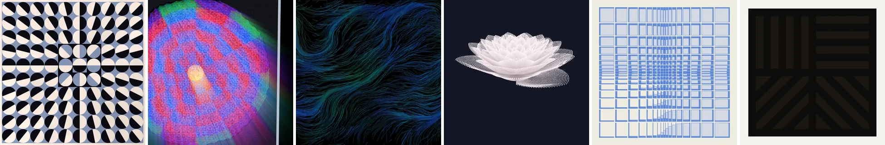

# practices

**An ongoing archive of generative art — drawn with code.**

67 standalone sketches in [p5.js](https://p5js.org) &amp; [three.js](https://threejs.org): geometric studies,
flow fields, recursive fractals, image mosaics, op-art recreations, and volumetric 3D glass.
Every piece is a single self-contained script — open it, run it, remix it.

<br>


</div>

---

## Gallery

<sub>Ordered as made, from the first studies to the latest pieces. Click any sketch to read its source.</sub>

<table>
  <tr>
    <td align="center" width="33.33%"><a href="artworks/p0.js">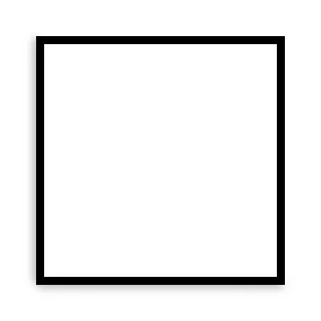</a><br><a href="artworks/p0.js"><b>Shadow Square Study</b></a><br><sub>p0 · geometric</sub></td>
    <td align="center" width="33.33%"><a href="artworks/p1.js">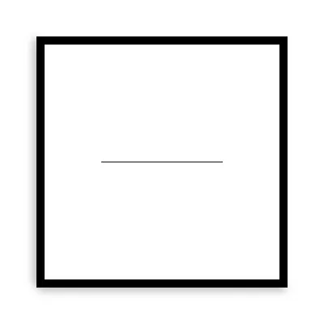</a><br><a href="artworks/p1.js"><b>Square with Center Line</b></a><br><sub>p1 · geometric</sub></td>
    <td align="center" width="33.33%"><a href="artworks/p2.js">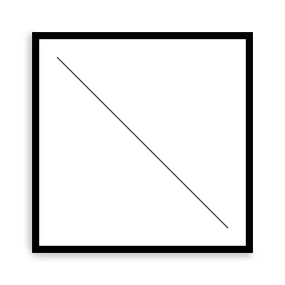</a><br><a href="artworks/p2.js"><b>Diagonal in a Box</b></a><br><sub>p2 · geometric</sub></td>
  </tr>
  <tr>
    <td align="center" width="33.33%"><a href="artworks/p3.js">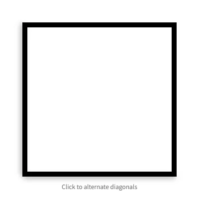</a><br><a href="artworks/p3.js"><b>Random Diagonal Lines</b></a><br><sub>p3 · interactive</sub></td>
    <td align="center" width="33.33%"><a href="artworks/p4.js">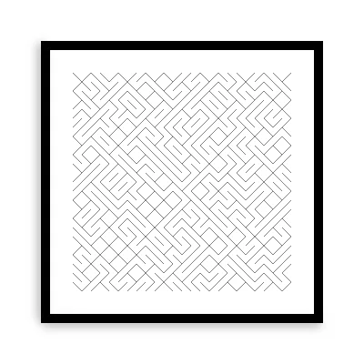</a><br><a href="artworks/p4.js"><b>Diagonal Tile Grid</b></a><br><sub>p4 · tiling</sub></td>
    <td align="center" width="33.33%"><a href="artworks/p5.js">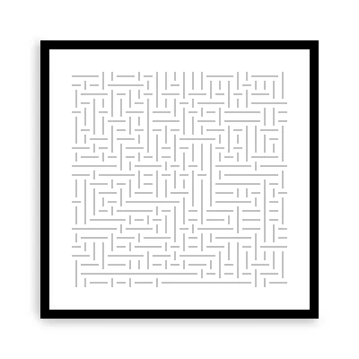</a><br><a href="artworks/p5.js"><b>Tiling Lines</b></a><br><sub>p5 · tiling</sub></td>
  </tr>
  <tr>
    <td align="center" width="33.33%"><a href="artworks/p6.js">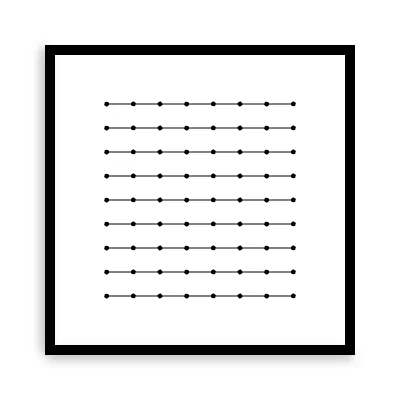</a><br><a href="artworks/p6.js"><b>Displacement Lines Grid</b></a><br><sub>p6 · geometric</sub></td>
    <td align="center" width="33.33%"><a href="artworks/p7.js">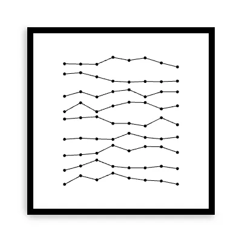</a><br><a href="artworks/p7.js"><b>Jittered Dot Lines</b></a><br><sub>p7 · geometric</sub></td>
    <td align="center" width="33.33%"><a href="artworks/p8.js">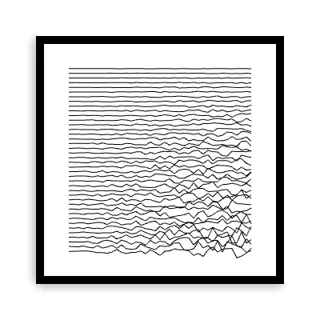</a><br><a href="artworks/p8.js"><b>Displaced Horizontal Lines</b></a><br><sub>p8 · generative</sub></td>
  </tr>
  <tr>
    <td align="center" width="33.33%"><a href="artworks/p9.js">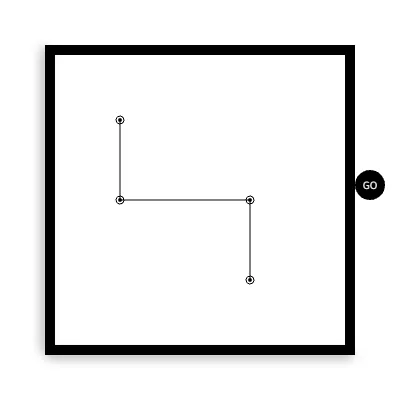</a><br><a href="artworks/p9.js"><b>De Casteljau Bézier</b></a><br><sub>p9 · bezier</sub></td>
    <td align="center" width="33.33%"><a href="artworks/p10.js">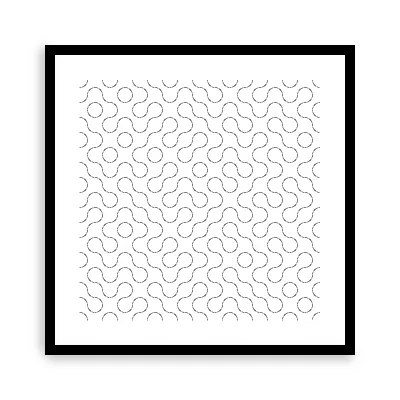</a><br><a href="artworks/p10.js"><b>Tiling Curves</b></a><br><sub>p10 · tiling</sub></td>
    <td align="center" width="33.33%"><a href="artworks/p11.js">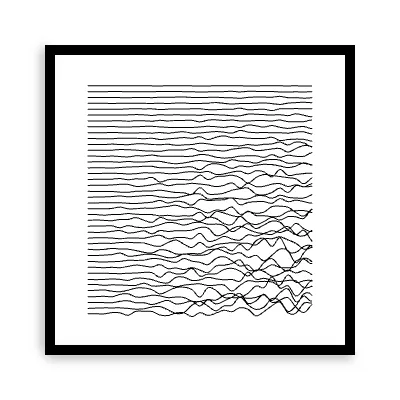</a><br><a href="artworks/p11.js"><b>Noise-Displaced Curves</b></a><br><sub>p11 · perlin-noise</sub></td>
  </tr>
  <tr>
    <td align="center" width="33.33%"><a href="artworks/p12.js">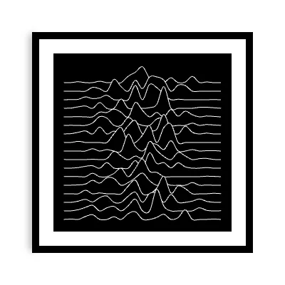</a><br><a href="artworks/p12.js"><b>Joy Division Logo</b></a><br><sub>p12 · generative</sub></td>
    <td align="center" width="33.33%"><a href="artworks/p13.js">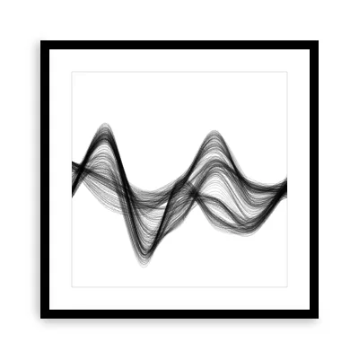</a><br><a href="artworks/p13.js"><b>Curved Lines Repetition</b></a><br><sub>p13 · generative</sub></td>
    <td align="center" width="33.33%"><a href="artworks/p14.js">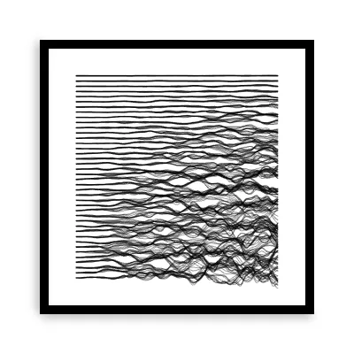</a><br><a href="artworks/p14.js"><b>Noise-Displaced Curve Field</b></a><br><sub>p14 · flow-field</sub></td>
  </tr>
  <tr>
    <td align="center" width="33.33%"><a href="artworks/p15.js">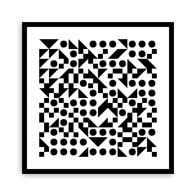</a><br><a href="artworks/p15.js"><b>Random Shape Tiling</b></a><br><sub>p15 · tiling</sub></td>
    <td align="center" width="33.33%"><a href="artworks/p16.js">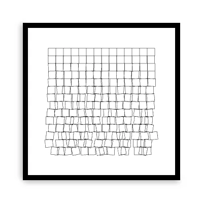</a><br><a href="artworks/p16.js"><b>Rotated &amp; Displaced Grid</b></a><br><sub>p16 · geometric</sub></td>
    <td align="center" width="33.33%"><a href="artworks/p17.js">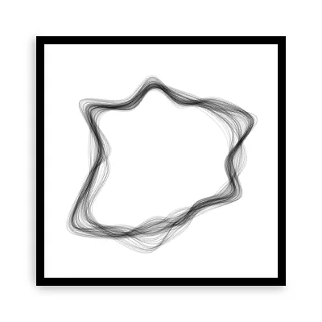</a><br><a href="artworks/p17.js"><b>Drifting Closed Curves</b></a><br><sub>p17 · generative</sub></td>
  </tr>
  <tr>
    <td align="center" width="33.33%"><a href="artworks/p18.js">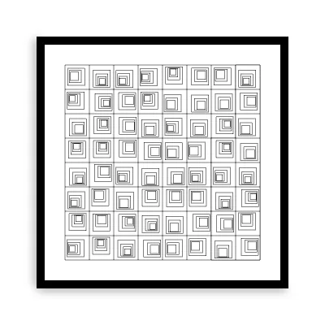</a><br><a href="artworks/p18.js"><b>Recursive Tile Drift</b></a><br><sub>p18 · recursion</sub></td>
    <td align="center" width="33.33%"><a href="artworks/p19.js">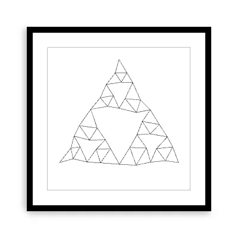</a><br><a href="artworks/p19.js"><b>Jittered Triangle Fractal</b></a><br><sub>p19 · recursion</sub></td>
    <td align="center" width="33.33%"><a href="artworks/p20.js">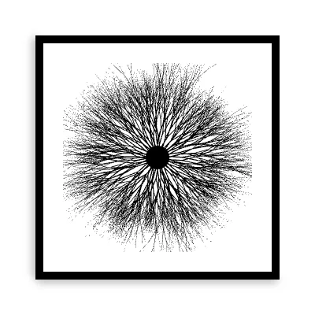</a><br><a href="artworks/p20.js"><b>Eye of Sauron</b></a><br><sub>p20 · recursion</sub></td>
  </tr>
  <tr>
    <td align="center" width="33.33%"><a href="artworks/p21.js">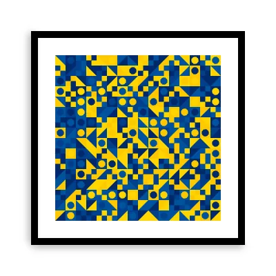</a><br><a href="artworks/p21.js"><b>Chromatic Tile Grid</b></a><br><sub>p21 · tiling</sub></td>
    <td align="center" width="33.33%"><a href="artworks/p22.js">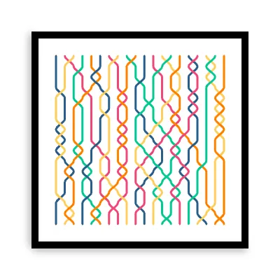</a><br><a href="artworks/p22.js"><b>Twisted Color Pipes</b></a><br><sub>p22 · generative</sub></td>
    <td align="center" width="33.33%"><a href="artworks/p23.js">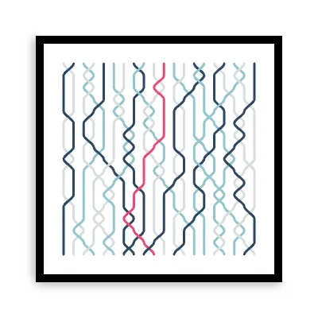</a><br><a href="artworks/p23.js"><b>Braided Color Pipes</b></a><br><sub>p23 · generative</sub></td>
  </tr>
  <tr>
    <td align="center" width="33.33%"><a href="artworks/p24.js">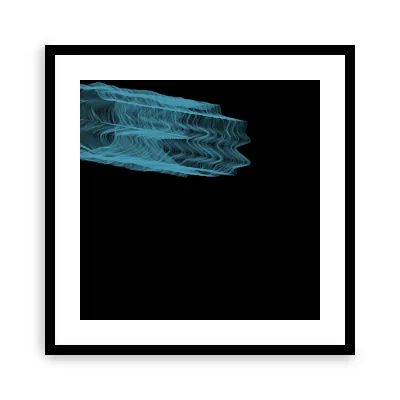</a><br><a href="artworks/p24.js"><b>Silky Drift Circles</b></a><br><sub>p24 · generative</sub></td>
    <td align="center" width="33.33%"><a href="artworks/p25.js">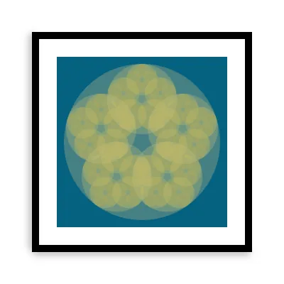</a><br><a href="artworks/p25.js"><b>Color Fractal Circles</b></a><br><sub>p25 · fractal</sub></td>
    <td align="center" width="33.33%"><a href="artworks/p26.js">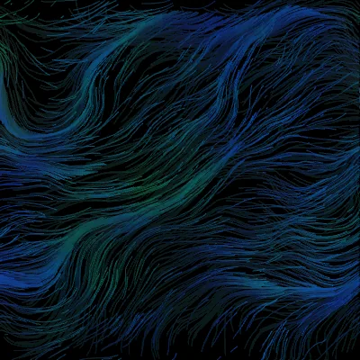</a><br><a href="artworks/p26.js"><b>Perlin Noise Flow Field</b></a><br><sub>p26 · flow-field</sub></td>
  </tr>
  <tr>
    <td align="center" width="33.33%"><a href="artworks/p27.js">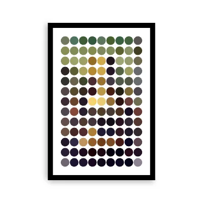</a><br><a href="artworks/p27.js"><b>Mona Lisa Circle Grid</b></a><br><sub>p27 · halftone</sub></td>
    <td align="center" width="33.33%"><a href="artworks/p28.js">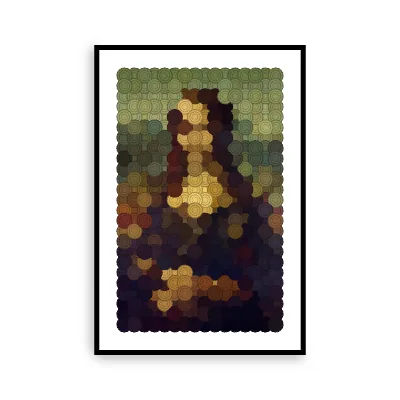</a><br><a href="artworks/p28.js"><b>Mona Lisa in Recursive Circles</b></a><br><sub>p28 · image-sampling</sub></td>
    <td align="center" width="33.33%"><a href="artworks/p29.js">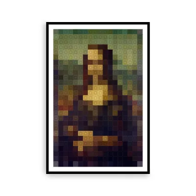</a><br><a href="artworks/p29.js"><b>Mona Lisa Lego Blocks</b></a><br><sub>p29 · pixel-art</sub></td>
  </tr>
  <tr>
    <td align="center" width="33.33%"><a href="artworks/p30.js">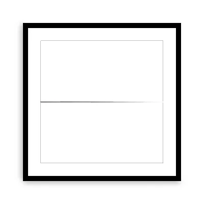</a><br><a href="artworks/p30.js"><b>Audio Spectrum Waves</b></a><br><sub>p30 · audio</sub></td>
    <td align="center" width="33.33%"><a href="artworks/p31.js">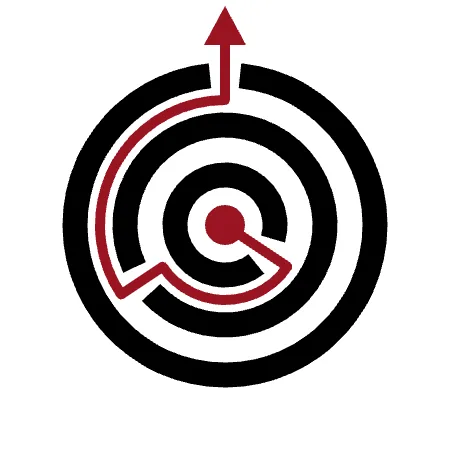</a><br><a href="artworks/p31.js"><b>Maze Escape Path</b></a><br><sub>p31 · geometric</sub></td>
    <td align="center" width="33.33%"><a href="artworks/p32.js">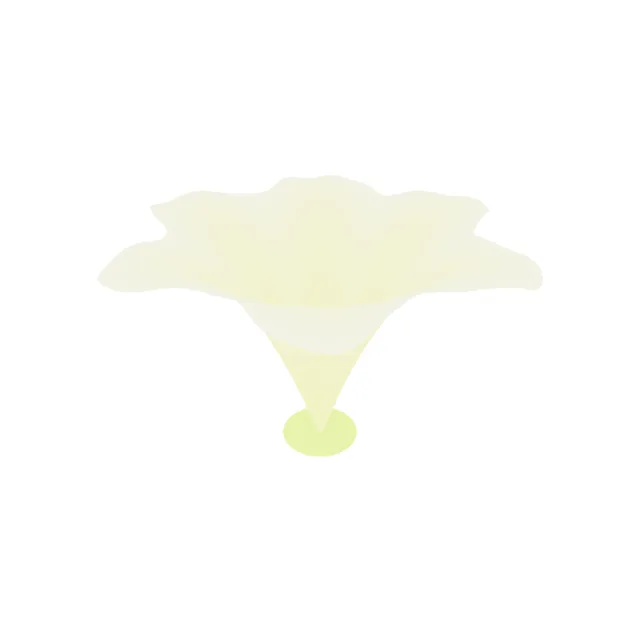</a><br><a href="artworks/p32.js"><b>3D Parametric Flower</b></a><br><sub>p32 · webgl</sub></td>
  </tr>
  <tr>
    <td align="center" width="33.33%"><a href="artworks/p33.js">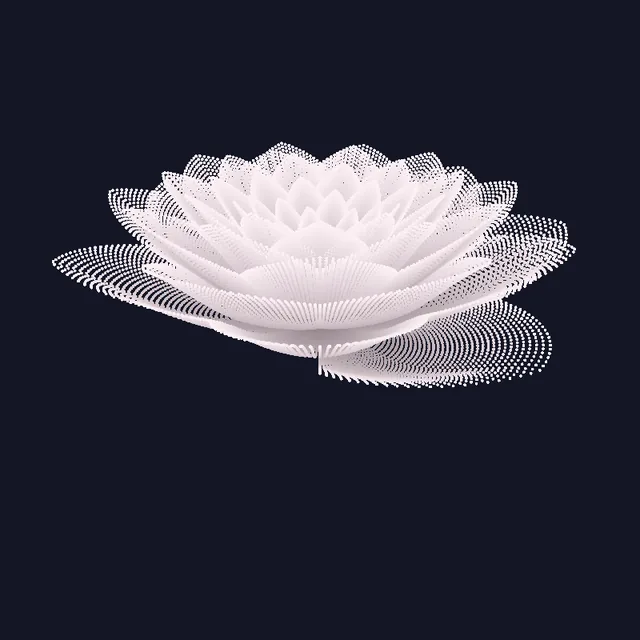</a><br><a href="artworks/p33.js"><b>Camellia Point Cloud</b></a><br><sub>p33 · webgl</sub></td>
    <td align="center" width="33.33%"><a href="artworks/p35.js"></a><br><a href="artworks/p35.js"><b>Calico Logo</b></a><br><sub>p35 · logo</sub></td>
    <td align="center" width="33.33%"><a href="artworks/p36.js">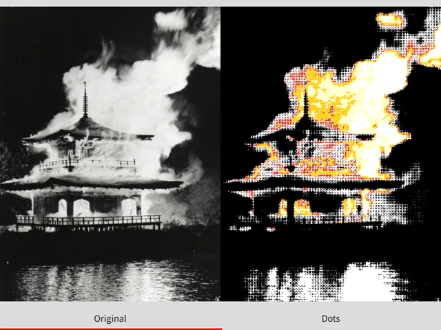</a><br><a href="artworks/p36.js"><b>Golden Pavilion on Fire</b></a><br><sub>p36 · halftone</sub></td>
  </tr>
  <tr>
    <td align="center" width="33.33%"><a href="artworks/p37.js">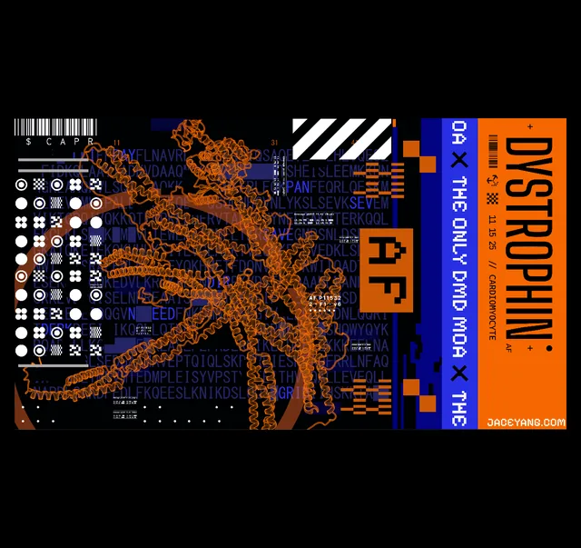</a><br><a href="artworks/p37.js"><b>Dystrophin Poster Display</b></a><br><sub>p37 · image</sub></td>
    <td align="center" width="33.33%"><a href="artworks/p38.js">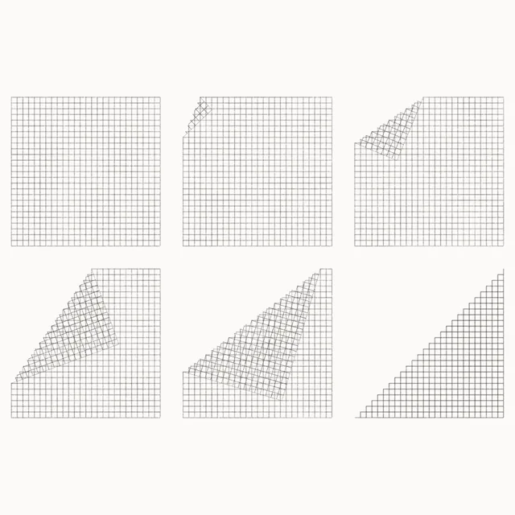</a><br><a href="artworks/p38.js"><b>Six Grids, Five Folds</b></a><br><sub>p38 · after John Walker, 2008</sub></td>
    <td align="center" width="33.33%"><a href="artworks/p39.js">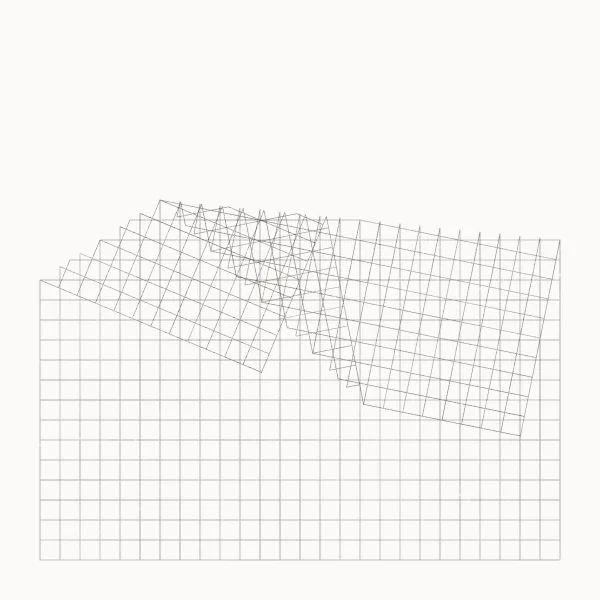</a><br><a href="artworks/p39.js"><b>Folding Grid</b></a><br><sub>p39 · geometric</sub></td>
  </tr>
  <tr>
    <td align="center" width="33.33%"><a href="artworks/p40.js">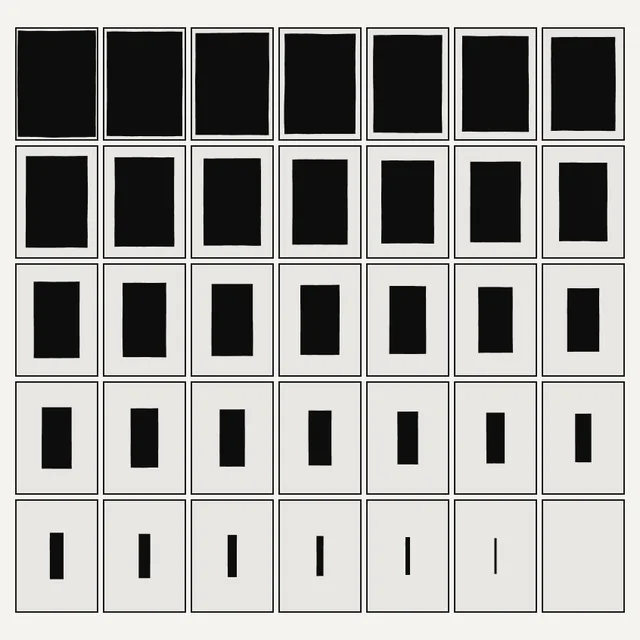</a><br><a href="artworks/p40.js"><b>Vanish</b></a><br><sub>p40 · after Sol LeWitt, 1994</sub></td>
    <td align="center" width="33.33%"><a href="artworks/p41.js"></a><br><a href="artworks/p41.js"><b>Ring and Cross Panels</b></a><br><sub>p41 · after Sol LeWitt</sub></td>
    <td align="center" width="33.33%"><a href="artworks/p42.js">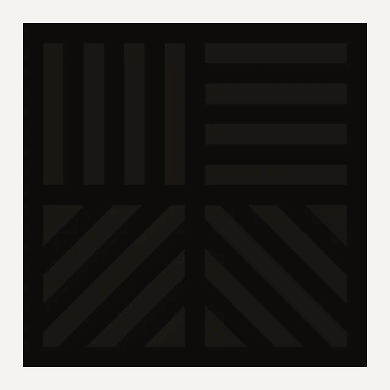</a><br><a href="artworks/p42.js"><b>Wall Drawing #821</b></a><br><sub>p42 · after Sol LeWitt, 1997</sub></td>
  </tr>
  <tr>
    <td align="center" width="33.33%"><a href="artworks/p43.js">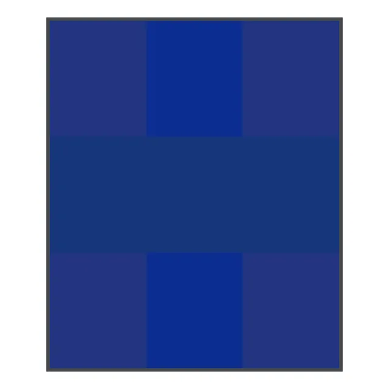</a><br><a href="artworks/p43.js"><b>Abstract Painting, Blue</b></a><br><sub>p43 · after Ad Reinhardt, 1953</sub></td>
    <td align="center" width="33.33%"><a href="artworks/p44.js">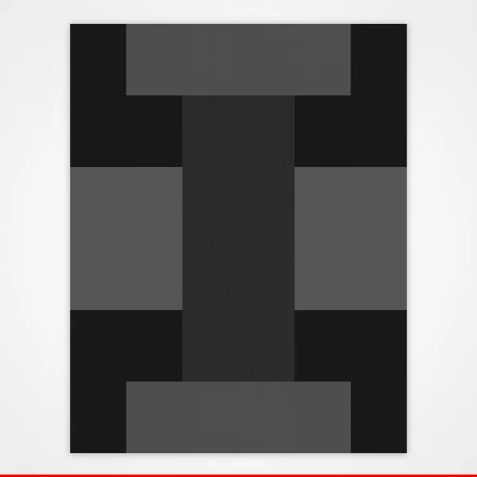</a><br><a href="artworks/p44.js"><b>Abstract Painting Black</b></a><br><sub>p44 · after Ad Reinhardt, 1960s</sub></td>
    <td align="center" width="33.33%"><a href="artworks/p45.js">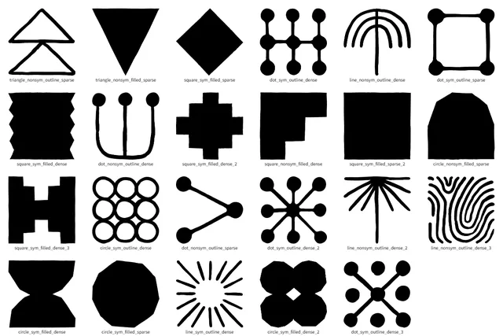</a><br><a href="artworks/p45.js"><b>Anthropic Shape Library</b></a><br><sub>p45 · grid</sub></td>
  </tr>
  <tr>
    <td align="center" width="33.33%"><a href="artworks/p46.js">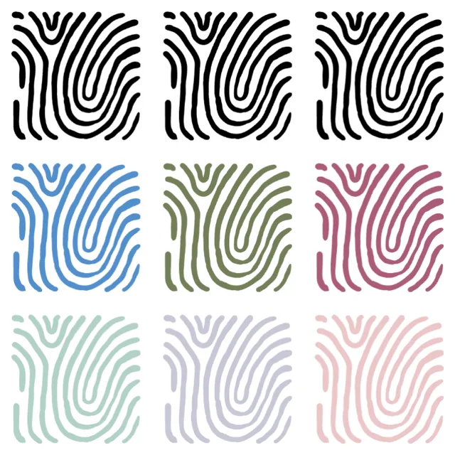</a><br><a href="artworks/p46.js"><b>One Shape, Seven Colors</b></a><br><sub>p46 · grid</sub></td>
    <td align="center" width="33.33%"><a href="artworks/p47.js">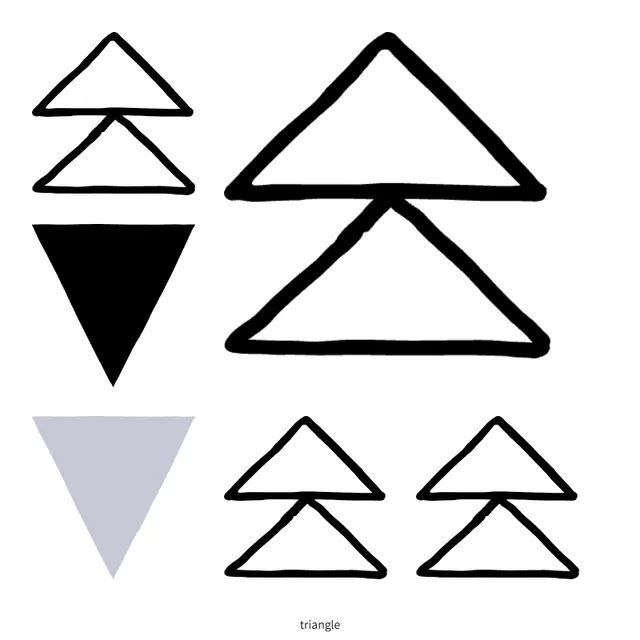</a><br><a href="artworks/p47.js"><b>Shape Grid with 2×2 Block</b></a><br><sub>p47 · grid</sub></td>
    <td align="center" width="33.33%"><a href="artworks/p48.js">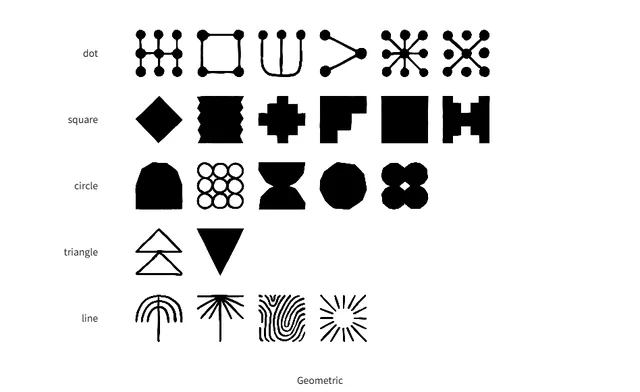</a><br><a href="artworks/p48.js"><b>Shape Category Browser</b></a><br><sub>p48 · svg</sub></td>
  </tr>
  <tr>
    <td align="center" width="33.33%"><a href="artworks/p49.js">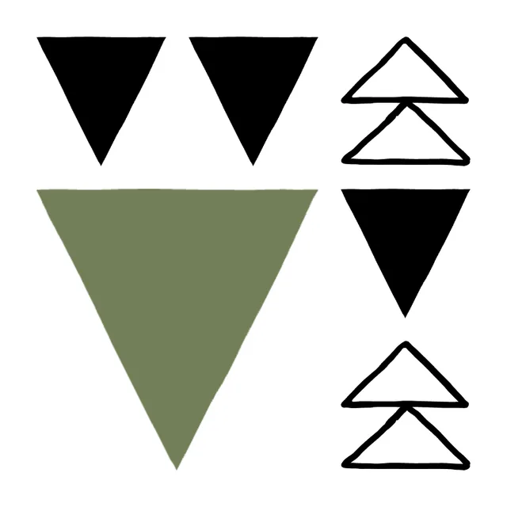</a><br><a href="artworks/p49.js"><b>Shape Grid, 2×2 Block</b></a><br><sub>p49 · grid</sub></td>
    <td align="center" width="33.33%"><a href="artworks/p50.js">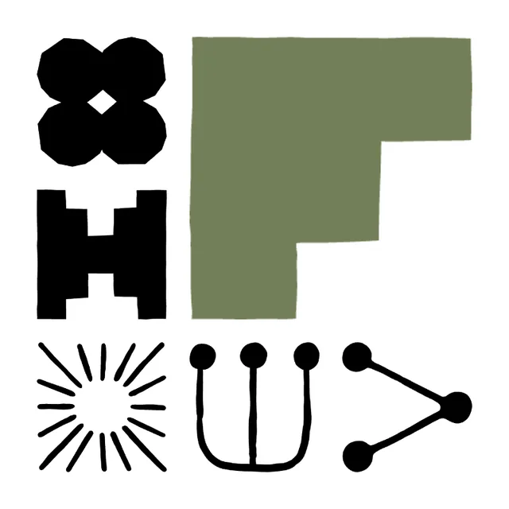</a><br><a href="artworks/p50.js"><b>Shape Grid, Color Accent</b></a><br><sub>p50 · grid</sub></td>
    <td align="center" width="33.33%"><a href="artworks/p51.js">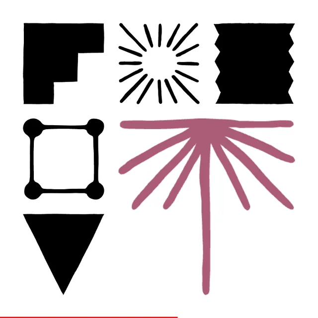</a><br><a href="artworks/p51.js"><b>SVG Shape Grid Mosaic</b></a><br><sub>p51 · geometric</sub></td>
  </tr>
  <tr>
    <td align="center" width="33.33%"><a href="artworks/p52.js">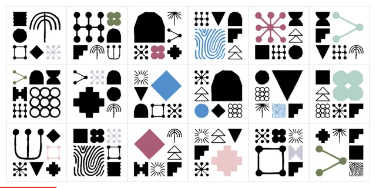</a><br><a href="artworks/p52.js"><b>18 Mini Compositions Grid</b></a><br><sub>p52 · grid</sub></td>
    <td align="center" width="33.33%"><a href="artworks/p53.js">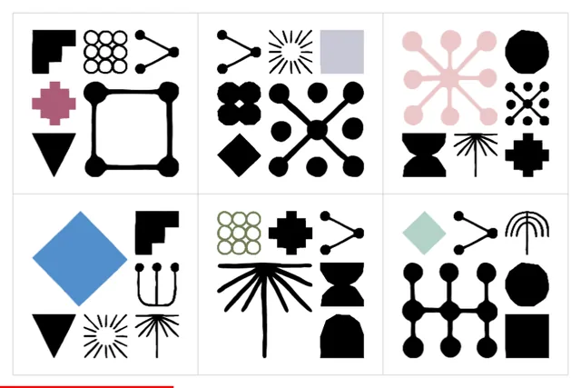</a><br><a href="artworks/p53.js"><b>Six Shape Compositions</b></a><br><sub>p53 · grid</sub></td>
    <td align="center" width="33.33%"><a href="artworks/p54.js">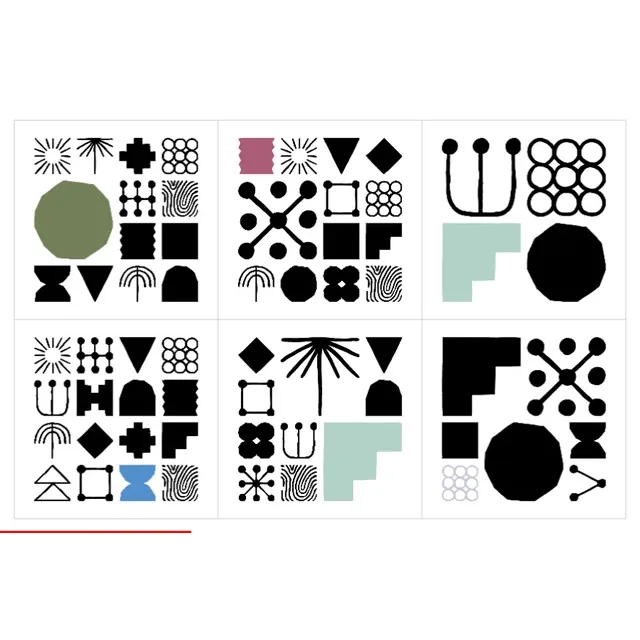</a><br><a href="artworks/p54.js"><b>SVG Shape Collage Grid</b></a><br><sub>p54 · grid</sub></td>
  </tr>
  <tr>
    <td align="center" width="33.33%"><a href="artworks/p55.js">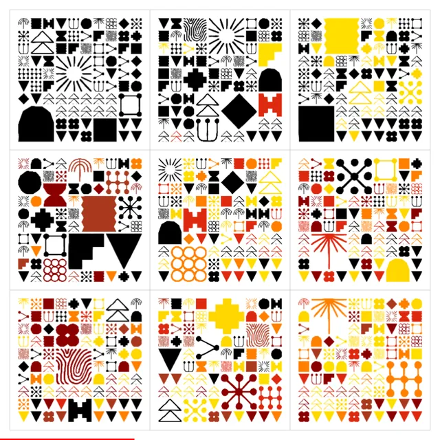</a><br><a href="artworks/p55.js"><b>Chromatic Density Grid</b></a><br><sub>p55 · grid</sub></td>
    <td align="center" width="33.33%"><a href="artworks/p56.js">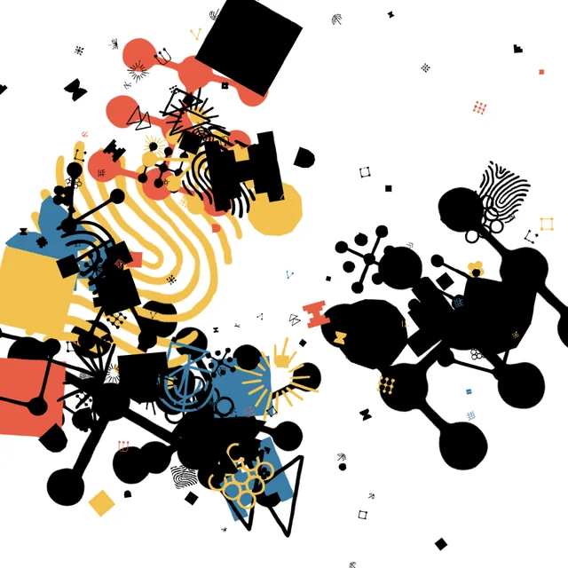</a><br><a href="artworks/p56.js"><b>Scale and Overlap</b></a><br><sub>p56 · collage</sub></td>
    <td align="center" width="33.33%"><a href="artworks/p57.js">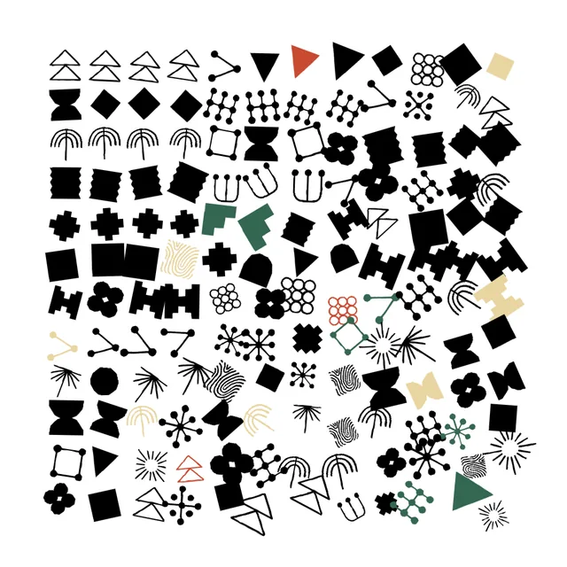</a><br><a href="artworks/p57.js"><b>Order to Chaos</b></a><br><sub>p57 · grid</sub></td>
  </tr>
  <tr>
    <td align="center" width="33.33%"><a href="artworks/p58.js">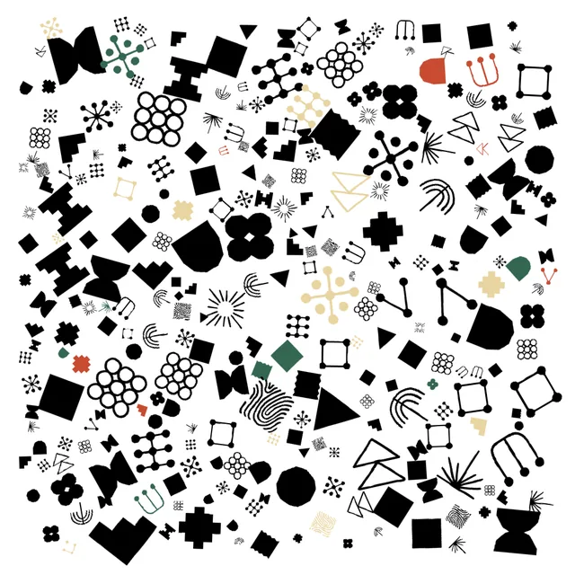</a><br><a href="artworks/p58.js"><b>SVG Shape Packing</b></a><br><sub>p58 · packing</sub></td>
    <td align="center" width="33.33%"><a href="artworks/p59.js">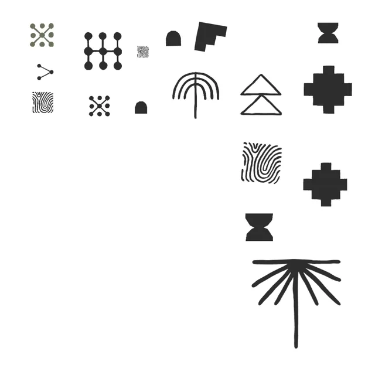</a><br><a href="artworks/p59.js"><b>Recursive Mondrian Grid</b></a><br><sub>p59 · recursion</sub></td>
    <td align="center" width="33.33%"><a href="artworks/p60.js">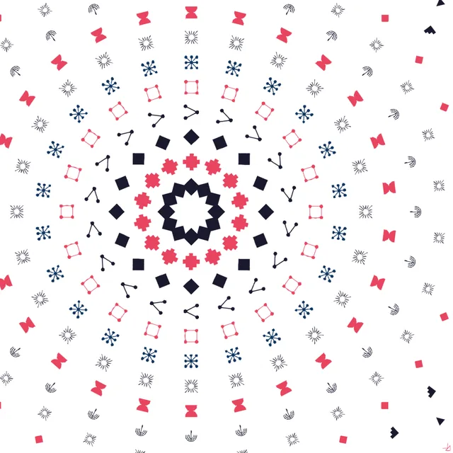</a><br><a href="artworks/p60.js"><b>Concentric Ripples</b></a><br><sub>p60 · concentric</sub></td>
  </tr>
  <tr>
    <td align="center" width="33.33%"><a href="artworks/p61.js">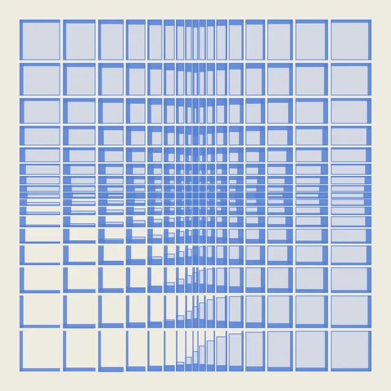</a><br><a href="artworks/p61.js"><b>Converging Grid</b></a><br><sub>p61 · after Pixel Symphony, 2025</sub></td>
    <td align="center" width="33.33%"><a href="artworks/p62.js">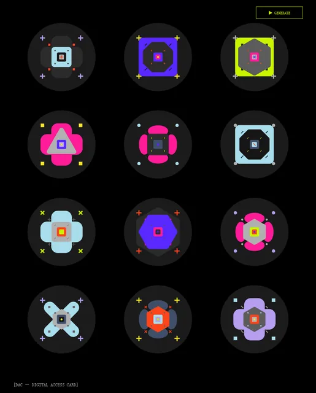</a><br><a href="artworks/p62.js"><b>DAC Badge Generator</b></a><br><sub>p62 · generative</sub></td>
    <td align="center" width="33.33%"><a href="artworks/p63.js">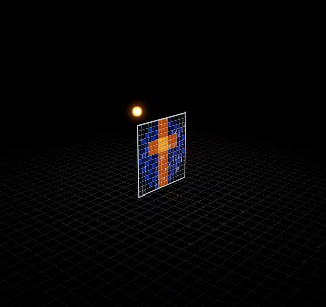</a><br><a href="artworks/p63.js"><b>Cathedral Glass</b></a><br><sub>p63 · three.js</sub></td>
  </tr>
  <tr>
    <td align="center" width="33.33%"><a href="artworks/p64.js">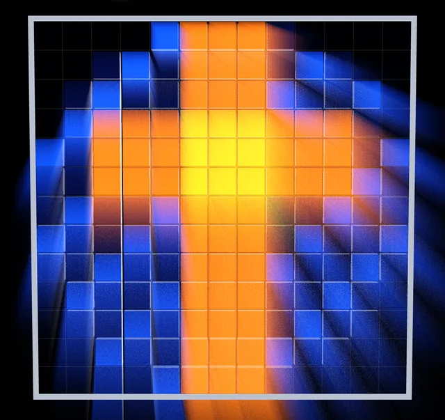</a><br><a href="artworks/p64.js"><b>God-Ray Weight Function</b></a><br><sub>p64 · three.js</sub></td>
    <td align="center" width="33.33%"><a href="artworks/p66.js">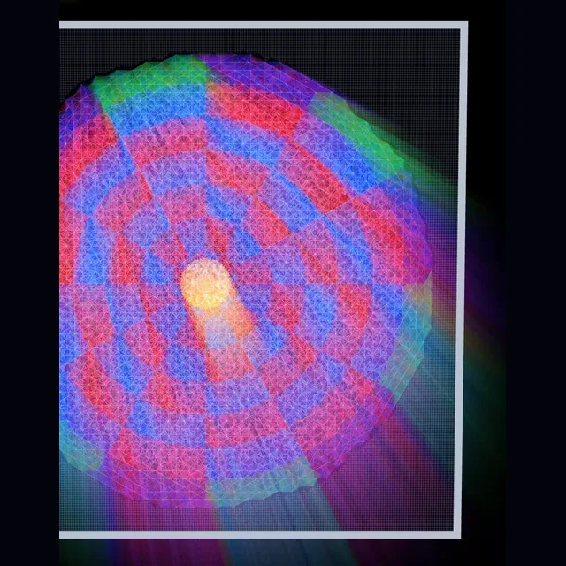</a><br><a href="artworks/p66.js"><b>Cathedral Unit-Distance Glass</b></a><br><sub>p66 · three.js</sub></td>
    <td align="center" width="33.33%"><a href="artworks/p67.js">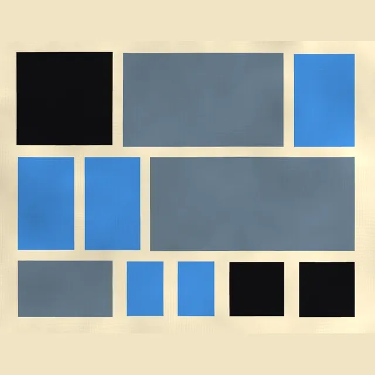</a><br><a href="artworks/p67.js"><b>3 Carrés Noirs</b></a><br><sub>p67 · after Vera Molnár, 1950</sub></td>
  </tr>
  <tr>
    <td align="center" width="33.33%"><a href="artworks/p68.js">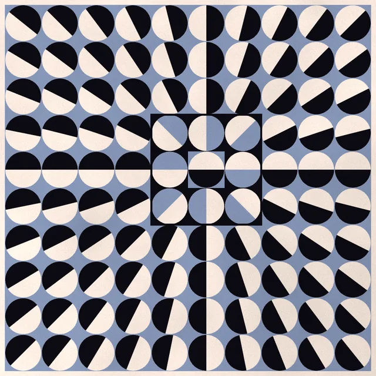</a><br><a href="artworks/p68.js"><b>Central Gravity</b></a><br><sub>p68 · after Milan Dobeš, 1965</sub></td>
  </tr>
</table>

---

<details>
<summary><b>Recreations &amp; references</b></summary>

<br>

Several pieces are faithful recreations of existing works, studied by rebuilding them in code:

- **Six Grids, Five Folds** — after John Walker, 2008 &nbsp;`p38`
- **Vanish** — after Sol LeWitt, 1994 &nbsp;`p40`
- **Ring and Cross Panels** — after Sol LeWitt &nbsp;`p41`
- **Wall Drawing #821** — after Sol LeWitt, 1997 &nbsp;`p42`
- **Abstract Painting, Blue** — after Ad Reinhardt, 1953 &nbsp;`p43`
- **Abstract Painting Black** — after Ad Reinhardt, 1960s &nbsp;`p44`
- **Converging Grid** — after Pixel Symphony, 2025 &nbsp;`p61`
- **3 Carrés Noirs** — after Vera Molnár, 1950 &nbsp;`p67`
- **Central Gravity** — after Milan Dobeš, 1965 &nbsp;`p68`

The early line-and-grid studies (`p0`–`p8`) follow exercises from Tim Holman's *Speedrunning through p5.js* talk.

</details>

<details>
<summary><b>Run it locally</b></summary>

<br>

```bash
npm install
npm run dev          # http://localhost:3000
```

A React + Vite gallery loads each sketch in an isolated iframe (p5.js from CDN).
Use the arrow keys or the control panel to move between pieces; press **S** to save the current frame as a PNG.

</details>

<details>
<summary><b>How it's built</b></summary>

<br>

- Sketches live in [`artworks/`](artworks/) as vanilla p5.js / three.js scripts (`p0.js` … `p68.js`).
- A small Vite plugin scans that folder and auto-generates the gallery manifest — adding a file is all it takes.
- The thumbnails above are rendered headlessly straight from the live sketches (see [`scripts/capture_gallery.py`](scripts/capture_gallery.py)).

</details>

<div align="center">
<sub>67 sketches · 62 p5.js · 5 WebGL/three.js · MIT licensed</sub>
</div>
