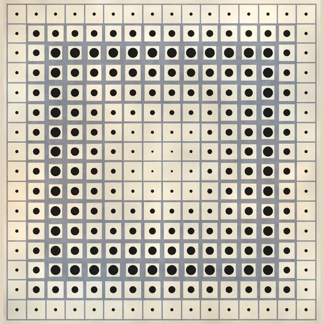
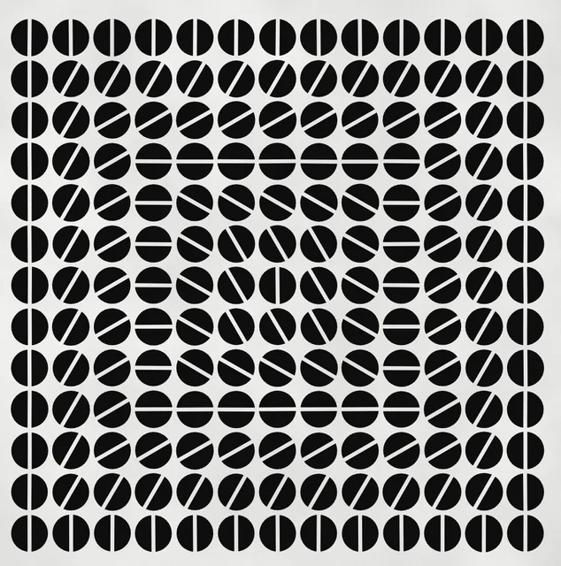

<div align="center">


# practices

**An ongoing archive of generative art — drawn with code.**

<br>


</div>

---

## Gallery

<sub>Ordered as made, from the first studies to the latest pieces.</sub>

<table>
  <tr>
    <td align="center" valign="top" width="33.33%"><a href="artworks/p0.js" title="Shadow Square Study"></a><br><a href="artworks/p0.js" title="Shadow Square Study"><b>Shadow Square</b></a><br><sub>p0 · geometric</sub></td>
    <td align="center" valign="top" width="33.33%"><a href="artworks/p1.js" title="Square with Center Line"></a><br><a href="artworks/p1.js" title="Square with Center Line"><b>Bisected Square</b></a><br><sub>p1 · geometric</sub></td>
    <td align="center" valign="top" width="33.33%"><a href="artworks/p2.js" title="Diagonal in a Box"></a><br><a href="artworks/p2.js" title="Diagonal in a Box"><b>Diagonal in a Box</b></a><br><sub>p2 · geometric</sub></td>
  </tr>
  <tr>
    <td align="center" valign="top" width="33.33%"><a href="artworks/p3.js" title="Random Diagonal Lines"></a><br><a href="artworks/p3.js" title="Random Diagonal Lines"><b>Random Diagonals</b></a><br><sub>p3 · interactive</sub></td>
    <td align="center" valign="top" width="33.33%"><a href="artworks/p4.js" title="Diagonal Tile Grid"></a><br><a href="artworks/p4.js" title="Diagonal Tile Grid"><b>Diagonal Tiles</b></a><br><sub>p4 · tiling</sub></td>
    <td align="center" valign="top" width="33.33%"><a href="artworks/p5.js" title="Tiling Lines"></a><br><a href="artworks/p5.js" title="Tiling Lines"><b>Tiling Lines</b></a><br><sub>p5 · tiling</sub></td>
  </tr>
  <tr>
    <td align="center" valign="top" width="33.33%"><a href="artworks/p6.js" title="Displacement Lines Grid"></a><br><a href="artworks/p6.js" title="Displacement Lines Grid"><b>Displaced Lines</b></a><br><sub>p6 · geometric</sub></td>
    <td align="center" valign="top" width="33.33%"><a href="artworks/p7.js" title="Displaced Horizontal Lines"></a><br><a href="artworks/p7.js" title="Displaced Horizontal Lines"><b>Jittered Dots</b></a><br><sub>p7 · geometric</sub></td>
    <td align="center" valign="top" width="33.33%"><a href="artworks/p8.js" title="Displaced Horizontal Lines"></a><br><a href="artworks/p8.js" title="Displaced Horizontal Lines"><b>Displaced Rows</b></a><br><sub>p8 · generative</sub></td>
  </tr>
  <tr>
    <td align="center" valign="top" width="33.33%"><a href="artworks/p9.js" title="De Casteljau Bézier"></a><br><a href="artworks/p9.js" title="De Casteljau Bézier"><b>De Casteljau</b></a><br><sub>p9 · bezier</sub></td>
    <td align="center" valign="top" width="33.33%"><a href="artworks/p10.js" title="Tiling Curves"></a><br><a href="artworks/p10.js" title="Tiling Curves"><b>Tiling Curves</b></a><br><sub>p10 · tiling</sub></td>
    <td align="center" valign="top" width="33.33%"><a href="artworks/p11.js" title="Noise-Displaced Curves"></a><br><a href="artworks/p11.js" title="Noise-Displaced Curves"><b>Noise Curves</b></a><br><sub>p11 · perlin-noise</sub></td>
  </tr>
  <tr>
    <td align="center" valign="top" width="33.33%"><a href="artworks/p12.js" title="Joy Division Logo"></a><br><a href="artworks/p12.js" title="Joy Division Logo"><b>Joy Division Logo</b></a><br><sub>p12 · generative</sub></td>
    <td align="center" valign="top" width="33.33%"><a href="artworks/p13.js" title="Curved Lines Repetition"></a><br><a href="artworks/p13.js" title="Curved Lines Repetition"><b>Drifting Splines</b></a><br><sub>p13 · generative</sub></td>
    <td align="center" valign="top" width="33.33%"><a href="artworks/p14.js" title="Noise-Displaced Curve Field"></a><br><a href="artworks/p14.js" title="Noise-Displaced Curve Field"><b>Noise Curtain</b></a><br><sub>p14 · flow-field</sub></td>
  </tr>
  <tr>
    <td align="center" valign="top" width="33.33%"><a href="artworks/p15.js" title="Random Shape Tiling"></a><br><a href="artworks/p15.js" title="Random Shape Tiling"><b>Random Tiles</b></a><br><sub>p15 · tiling</sub></td>
    <td align="center" valign="top" width="33.33%"><a href="artworks/p16.js" title="Rotated &amp; Displaced Grid"></a><br><a href="artworks/p16.js" title="Rotated &amp; Displaced Grid"><b>Rotated Grid</b></a><br><sub>p16 · geometric</sub></td>
    <td align="center" valign="top" width="33.33%"><a href="artworks/p17.js" title="Drifting Closed Curves"></a><br><a href="artworks/p17.js" title="Drifting Closed Curves"><b>Drifting Curves</b></a><br><sub>p17 · generative</sub></td>
  </tr>
  <tr>
    <td align="center" valign="top" width="33.33%"><a href="artworks/p18.js" title="Recursive Tile Drift"></a><br><a href="artworks/p18.js" title="Recursive Tile Drift"><b>Tile Drift</b></a><br><sub>p18 · recursion</sub></td>
    <td align="center" valign="top" width="33.33%"><a href="artworks/p19.js" title="Jittered Triangle Fractal"></a><br><a href="artworks/p19.js" title="Jittered Triangle Fractal"><b>Triangle Fractal</b></a><br><sub>p19 · recursion</sub></td>
    <td align="center" valign="top" width="33.33%"><a href="artworks/p20.js" title="Eye of Sauron"></a><br><a href="artworks/p20.js" title="Eye of Sauron"><b>Eye of Sauron</b></a><br><sub>p20 · recursion</sub></td>
  </tr>
  <tr>
    <td align="center" valign="top" width="33.33%"><a href="artworks/p21.js" title="Chromatic Tile Grid"></a><br><a href="artworks/p21.js" title="Chromatic Tile Grid"><b>Chromatic Tiles</b></a><br><sub>p21 · tiling</sub></td>
    <td align="center" valign="top" width="33.33%"><a href="artworks/p22.js" title="Twisted Color Pipes"></a><br><a href="artworks/p22.js" title="Twisted Color Pipes"><b>Twisted Pipes</b></a><br><sub>p22 · generative</sub></td>
    <td align="center" valign="top" width="33.33%"><a href="artworks/p23.js" title="Braided Color Pipes"></a><br><a href="artworks/p23.js" title="Braided Color Pipes"><b>Braided Pipes</b></a><br><sub>p23 · generative</sub></td>
  </tr>
  <tr>
    <td align="center" valign="top" width="33.33%"><a href="artworks/p24.js" title="Silky Drift Circles"></a><br><a href="artworks/p24.js" title="Silky Drift Circles"><b>Silky Drift</b></a><br><sub>p24 · generative</sub></td>
    <td align="center" valign="top" width="33.33%"><a href="artworks/p25.js" title="Color Fractal Circles"></a><br><a href="artworks/p25.js" title="Color Fractal Circles"><b>Fractal Circles</b></a><br><sub>p25 · fractal</sub></td>
    <td align="center" valign="top" width="33.33%"><a href="artworks/p26.js" title="Perlin Noise Flow Field"></a><br><a href="artworks/p26.js" title="Perlin Noise Flow Field"><b>Flow Field</b></a><br><sub>p26 · flow-field</sub></td>
  </tr>
  <tr>
    <td align="center" valign="top" width="33.33%"><a href="artworks/p27.js" title="Mona Lisa Circle Grid"></a><br><a href="artworks/p27.js" title="Mona Lisa Circle Grid"><b>Mona Lisa Circles</b></a><br><sub>p27 · halftone</sub></td>
    <td align="center" valign="top" width="33.33%"><a href="artworks/p28.js" title="Mona Lisa in Recursive Circles"></a><br><a href="artworks/p28.js" title="Mona Lisa in Recursive Circles"><b>Mona Lisa Rings</b></a><br><sub>p28 · image-sampling</sub></td>
    <td align="center" valign="top" width="33.33%"><a href="artworks/p29.js" title="Mona Lisa Lego Blocks"></a><br><a href="artworks/p29.js" title="Mona Lisa Lego Blocks"><b>Mona Lisa Lego</b></a><br><sub>p29 · pixel-art</sub></td>
  </tr>
  <tr>
    <td align="center" valign="top" width="33.33%"><a href="artworks/p30.js" title="Audio Spectrum Waves"></a><br><a href="artworks/p30.js" title="Audio Spectrum Waves"><b>Audio Spectrum</b></a><br><sub>p30 · audio</sub></td>
    <td align="center" valign="top" width="33.33%"><a href="artworks/p31.js" title="Maze Escape Path"></a><br><a href="artworks/p31.js" title="Maze Escape Path"><b>Maze Escape Path</b></a><br><sub>p31 · geometric</sub></td>
    <td align="center" valign="top" width="33.33%"><a href="artworks/p32.js" title="3D Parametric Flower"></a><br><a href="artworks/p32.js" title="3D Parametric Flower"><b>Parametric Flower</b></a><br><sub>p32 · webgl</sub></td>
  </tr>
  <tr>
    <td align="center" valign="top" width="33.33%"><a href="artworks/p33.js" title="Camellia Point Cloud"></a><br><a href="artworks/p33.js" title="Camellia Point Cloud"><b>Camellia Cloud</b></a><br><sub>p33 · webgl</sub></td>
    <td align="center" valign="top" width="33.33%"><a href="artworks/p35.js" title="Calico Logo"></a><br><a href="artworks/p35.js" title="Calico Logo"><b>Calico Logo</b></a><br><sub>p35 · logo</sub></td>
    <td align="center" valign="top" width="33.33%"><a href="artworks/p36.js" title="Golden Pavilion on Fire"></a><br><a href="artworks/p36.js" title="Golden Pavilion on Fire"><b>Pavilion on Fire</b></a><br><sub>p36 · halftone</sub></td>
  </tr>
  <tr>
    <td align="center" valign="top" width="33.33%"><a href="artworks/p37.js" title="Dystrophin Poster Display"></a><br><a href="artworks/p37.js" title="Dystrophin Poster Display"><b>Dystrophin Poster</b></a><br><sub>p37 · image</sub></td>
    <td align="center" valign="top" width="33.33%"><a href="artworks/p38.js" title="Six Grids, Five Folds"></a><br><a href="artworks/p38.js" title="Six Grids, Five Folds"><b>Folded Grids</b></a><br><sub>p38 · after John Walker, 2008</sub></td>
    <td align="center" valign="top" width="33.33%"><a href="artworks/p39.js" title="Folding Grid"></a><br><a href="artworks/p39.js" title="Folding Grid"><b>Folding Grid</b></a><br><sub>p39 · geometric</sub></td>
  </tr>
  <tr>
    <td align="center" valign="top" width="33.33%"><a href="artworks/p40.js" title="Vanish"></a><br><a href="artworks/p40.js" title="Vanish"><b>Vanish</b></a><br><sub>p40 · after Sol LeWitt, 1994</sub></td>
    <td align="center" valign="top" width="33.33%"><a href="artworks/p41.js" title="Ring and Cross Panels"></a><br><a href="artworks/p41.js" title="Ring and Cross Panels"><b>Ring &amp; Cross</b></a><br><sub>p41 · after Sol LeWitt</sub></td>
    <td align="center" valign="top" width="33.33%"><a href="artworks/p42.js" title="Wall Drawing #821"></a><br><a href="artworks/p42.js" title="Wall Drawing #821"><b>Wall Drawing #821</b></a><br><sub>p42 · after Sol LeWitt, 1997</sub></td>
  </tr>
  <tr>
    <td align="center" valign="top" width="33.33%"><a href="artworks/p43.js" title="Abstract Painting, Blue"></a><br><a href="artworks/p43.js" title="Abstract Painting, Blue"><b>Painting, Blue</b></a><br><sub>p43 · after Ad Reinhardt, 1953</sub></td>
    <td align="center" valign="top" width="33.33%"><a href="artworks/p44.js" title="Abstract Painting Black"></a><br><a href="artworks/p44.js" title="Abstract Painting Black"><b>Painting, Black</b></a><br><sub>p44 · after Ad Reinhardt, 1960s</sub></td>
    <td align="center" valign="top" width="33.33%"><a href="artworks/p45.js" title="Anthropic Shape Library"></a><br><a href="artworks/p45.js" title="Anthropic Shape Library"><b>Shape Library</b></a><br><sub>p45 · grid</sub></td>
  </tr>
  <tr>
    <td align="center" valign="top" width="33.33%"><a href="artworks/p46.js" title="One Shape, Seven Colors"></a><br><a href="artworks/p46.js" title="One Shape, Seven Colors"><b>Seven Colors</b></a><br><sub>p46 · grid</sub></td>
    <td align="center" valign="top" width="33.33%"><a href="artworks/p47.js" title="Shape Grid with 2×2 Block"></a><br><a href="artworks/p47.js" title="Shape Grid with 2×2 Block"><b>Accent Block Grid</b></a><br><sub>p47 · grid</sub></td>
    <td align="center" valign="top" width="33.33%"><a href="artworks/p48.js" title="Shape Category Browser"></a><br><a href="artworks/p48.js" title="Shape Category Browser"><b>Shape Browser</b></a><br><sub>p48 · svg</sub></td>
  </tr>
  <tr>
    <td align="center" valign="top" width="33.33%"><a href="artworks/p49.js" title="Shape Grid 2×2 Block"></a><br><a href="artworks/p49.js" title="Shape Grid 2×2 Block"><b>2×2 Block Grid</b></a><br><sub>p49 · grid</sub></td>
    <td align="center" valign="top" width="33.33%"><a href="artworks/p50.js" title="Shape Grid 2×2 Block"></a><br><a href="artworks/p50.js" title="Shape Grid 2×2 Block"><b>Color Accent Grid</b></a><br><sub>p50 · grid</sub></td>
    <td align="center" valign="top" width="33.33%"><a href="artworks/p51.js" title="SVG Shape Grid Mosaic"></a><br><a href="artworks/p51.js" title="SVG Shape Grid Mosaic"><b>Shape Mosaic</b></a><br><sub>p51 · geometric</sub></td>
  </tr>
  <tr>
    <td align="center" valign="top" width="33.33%"><a href="artworks/p52.js" title="18 Mini Compositions Grid"></a><br><a href="artworks/p52.js" title="18 Mini Compositions Grid"><b>18 Compositions</b></a><br><sub>p52 · grid</sub></td>
    <td align="center" valign="top" width="33.33%"><a href="artworks/p53.js" title="Six Shape Compositions"></a><br><a href="artworks/p53.js" title="Six Shape Compositions"><b>Six Compositions</b></a><br><sub>p53 · grid</sub></td>
    <td align="center" valign="top" width="33.33%"><a href="artworks/p54.js" title="SVG Shape Collage Grid"></a><br><a href="artworks/p54.js" title="SVG Shape Collage Grid"><b>Shape Collage</b></a><br><sub>p54 · grid</sub></td>
  </tr>
  <tr>
    <td align="center" valign="top" width="33.33%"><a href="artworks/p55.js" title="Chromatic Density Grid"></a><br><a href="artworks/p55.js" title="Chromatic Density Grid"><b>Density Gradient</b></a><br><sub>p55 · grid</sub></td>
    <td align="center" valign="top" width="33.33%"><a href="artworks/p56.js" title="Scale and Overlap"></a><br><a href="artworks/p56.js" title="Scale and Overlap"><b>Scale &amp; Overlap</b></a><br><sub>p56 · collage</sub></td>
    <td align="center" valign="top" width="33.33%"><a href="artworks/p57.js" title="Order to Chaos"></a><br><a href="artworks/p57.js" title="Order to Chaos"><b>Order to Chaos</b></a><br><sub>p57 · grid</sub></td>
  </tr>
  <tr>
    <td align="center" valign="top" width="33.33%"><a href="artworks/p58.js" title="SVG Shape Packing"></a><br><a href="artworks/p58.js" title="SVG Shape Packing"><b>Shape Packing</b></a><br><sub>p58 · packing</sub></td>
    <td align="center" valign="top" width="33.33%"><a href="artworks/p59.js" title="Recursive Mondrian Grid"></a><br><a href="artworks/p59.js" title="Recursive Mondrian Grid"><b>Mondrian Split</b></a><br><sub>p59 · recursion</sub></td>
    <td align="center" valign="top" width="33.33%"><a href="artworks/p60.js" title="Concentric Ripples"></a><br><a href="artworks/p60.js" title="Concentric Ripples"><b>Radial Ripples</b></a><br><sub>p60 · concentric</sub></td>
  </tr>
  <tr>
    <td align="center" valign="top" width="33.33%"><a href="artworks/p61.js" title="Converging Grid"></a><br><a href="artworks/p61.js" title="Converging Grid"><b>Converging Grid</b></a><br><sub>p61 · after Pixel Symphony, 2025</sub></td>
    <td align="center" valign="top" width="33.33%"><a href="artworks/p62.js" title="DAC Badge Generator"></a><br><a href="artworks/p62.js" title="DAC Badge Generator"><b>DAC Badges</b></a><br><sub>p62 · generative</sub></td>
    <td align="center" valign="top" width="33.33%"><a href="artworks/p63.js" title="Cathedral Glass"></a><br><a href="artworks/p63.js" title="Cathedral Glass"><b>Cathedral Glass</b></a><br><sub>p63 · three.js</sub></td>
  </tr>
  <tr>
    <td align="center" valign="top" width="33.33%"><a href="artworks/p64.js" title="God-Ray Weight Function"></a><br><a href="artworks/p64.js" title="God-Ray Weight Function"><b>God-Ray Falloff</b></a><br><sub>p64 · three.js</sub></td>
    <td align="center" valign="top" width="33.33%"><a href="artworks/p66.js" title="Cathedral Unit-Distance Glass"></a><br><a href="artworks/p66.js" title="Cathedral Unit-Distance Glass"><b>Leaded Glass Dome</b></a><br><sub>p66 · three.js</sub></td>
    <td align="center" valign="top" width="33.33%"><a href="artworks/p67.js" title="3 Carrés Noirs"></a><br><a href="artworks/p67.js" title="3 Carrés Noirs"><b>3 Carrés Noirs</b></a><br><sub>p67 · after Vera Molnár, 1950</sub></td>
  </tr>
  <tr>
    <td align="center" valign="top" width="33.33%"><a href="artworks/p68.js" title="Central Gravity"></a><br><a href="artworks/p68.js" title="Central Gravity"><b>Central Gravity</b></a><br><sub>p68 · after Milan Dobeš, 1965</sub></td>
    <td align="center" valign="top" width="33.33%"><a href="artworks/p69.js" title="Double Progression"></a><br><a href="artworks/p69.js" title="Double Progression"><b>Double Progression</b></a><br><sub>p69 · after Julio Le Parc, 1959</sub></td>
    <td align="center" valign="top" width="33.33%"><a href="artworks/p70.js" title="Brix"></a><br><a href="artworks/p70.js" title="Brix"><b>Brix</b></a><br><sub>p70 · after Horacio García Rossi, 1959</sub></td>
  </tr>
</table>

---

<details>
<summary><b>References</b></summary>

<br>

Several pieces are faithful recreations of existing works, studied by rebuilding them in code:

- **Folded Grids** — after John Walker, 2008 &nbsp;`p38`
- **Vanish** — after Sol LeWitt, 1994 &nbsp;`p40`
- **Ring & Cross** — after Sol LeWitt &nbsp;`p41`
- **Wall Drawing #821** — after Sol LeWitt, 1997 &nbsp;`p42`
- **Painting, Blue** — after Ad Reinhardt, 1953 &nbsp;`p43`
- **Painting, Black** — after Ad Reinhardt, 1960s &nbsp;`p44`
- **Converging Grid** — after Pixel Symphony, 2025 &nbsp;`p61`
- **3 Carrés Noirs** — after Vera Molnár, 1950 &nbsp;`p67`
- **Central Gravity** — after Milan Dobeš, 1965 &nbsp;`p68`
- **Double Progression** — after Julio Le Parc, 1959 &nbsp;`p69`
- **Brix** — after Horacio García Rossi, 1959 &nbsp;`p70`

The early line-and-grid studies (`p0`–`p8`) follow exercises from Tim Holman's *Speedrunning through p5.js* talk.

</details>

<details>
<summary><b>Run it locally</b></summary>

<br>

```bash
npm install
npm run dev          # http://localhost:3000
```

A React + Vite gallery loads each sketch in an isolated iframe (p5.js from CDN).
Use the arrow keys or the control panel to move between pieces; press **S** to save the current frame as a PNG.

</details>

<details>
<summary><b>How it's built</b></summary>

<br>

- Sketches live in [`artworks/`](artworks/) as vanilla p5.js / three.js scripts (`p0.js` … `p70.js`).
- A small Vite plugin scans that folder and auto-generates the gallery manifest — adding a file is all it takes.
- The thumbnails above are rendered headlessly straight from the live sketches (see [`scripts/capture_gallery.py`](scripts/capture_gallery.py)).

</details>
