<div align="center">

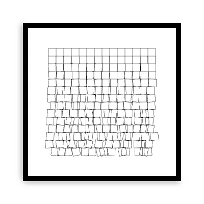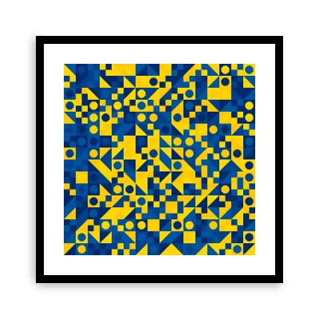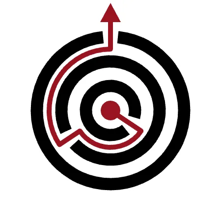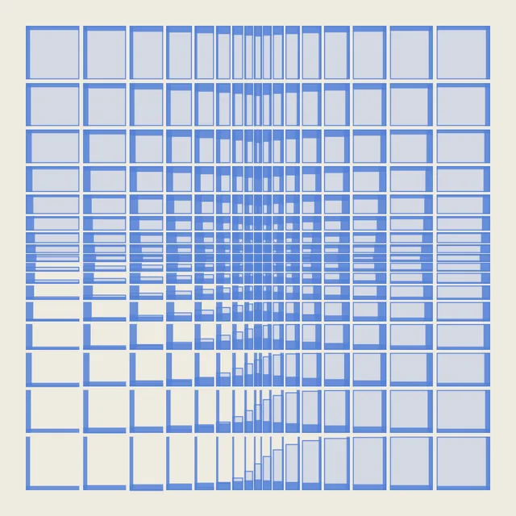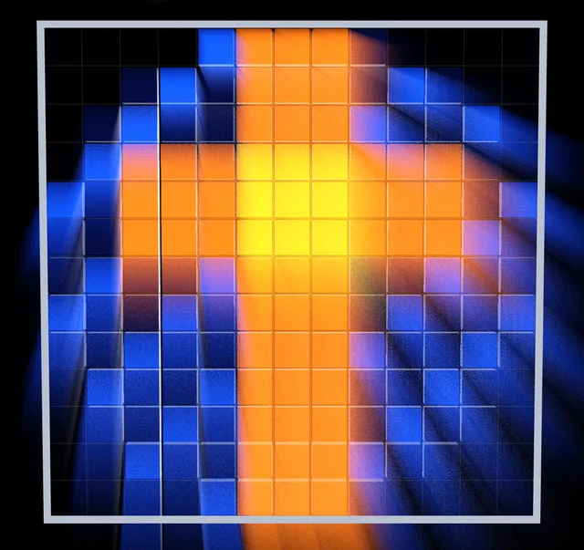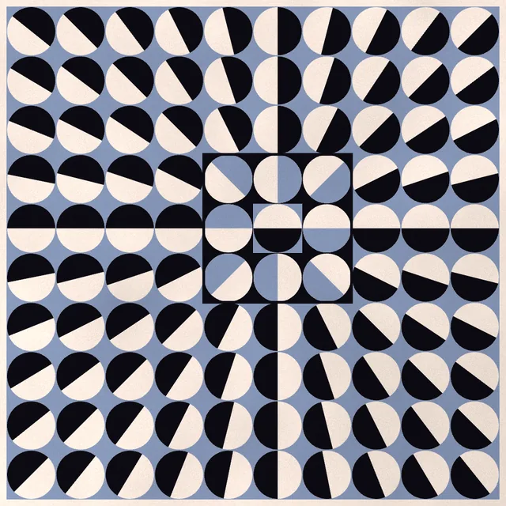

# practices

**An ongoing archive of generative art — drawn with code.**

<sub>86 standalone sketches in p5.js and three.js.</sub>

<br>


</div>

---

## Gallery

<sub>Ordered as made, from the first studies to the latest pieces.</sub>

Recreations and source-based studies use **Tribute to Artist: Work**. Tutorial, style, and composition variations retain their study names after the colon. Unknown titles or authors use **Unknown**; multiple unknown works by the same artist are numbered **Unknown #1**, **Unknown #2**, and so on.

<table>
  <tr>
    <td align="center" valign="top" width="33.33%"><a href="artworks/p0.js" title="Tribute to Tim Holman: Shadow Square">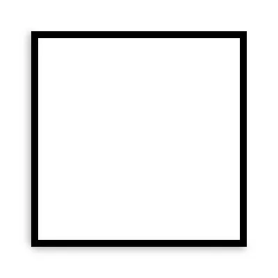</a><br><a href="artworks/p0.js" title="Tribute to Tim Holman: Shadow Square"><b>Tribute to Tim Holman: Shadow Square</b></a><br><sub>p0 · geometric</sub></td>
    <td align="center" valign="top" width="33.33%"><a href="artworks/p1.js" title="Tribute to Tim Holman: Bisected Square">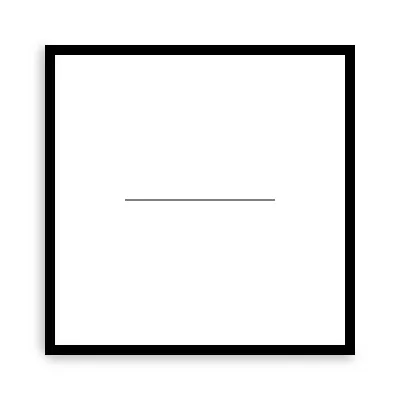</a><br><a href="artworks/p1.js" title="Tribute to Tim Holman: Bisected Square"><b>Tribute to Tim Holman: Bisected Square</b></a><br><sub>p1 · geometric</sub></td>
    <td align="center" valign="top" width="33.33%"><a href="artworks/p2.js" title="Tribute to Tim Holman: Diagonal in a Box">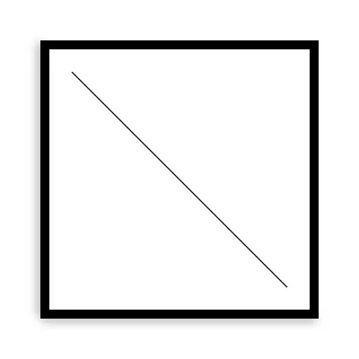</a><br><a href="artworks/p2.js" title="Tribute to Tim Holman: Diagonal in a Box"><b>Tribute to Tim Holman: Diagonal in a Box</b></a><br><sub>p2 · geometric</sub></td>
  </tr>
  <tr>
    <td align="center" valign="top" width="33.33%"><a href="artworks/p3.js" title="Tribute to Tim Holman: Random Diagonals">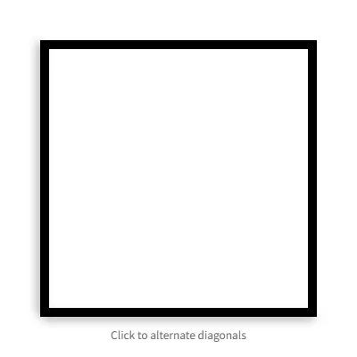</a><br><a href="artworks/p3.js" title="Tribute to Tim Holman: Random Diagonals"><b>Tribute to Tim Holman: Random Diagonals</b></a><br><sub>p3 · interactive</sub></td>
    <td align="center" valign="top" width="33.33%"><a href="artworks/p4.js" title="Tribute to Tim Holman: Diagonal Tiles">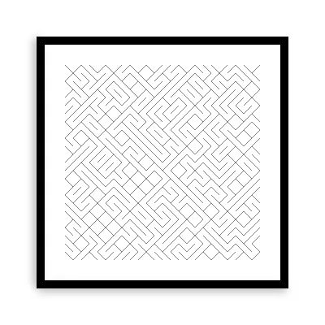</a><br><a href="artworks/p4.js" title="Tribute to Tim Holman: Diagonal Tiles"><b>Tribute to Tim Holman: Diagonal Tiles</b></a><br><sub>p4 · tiling</sub></td>
    <td align="center" valign="top" width="33.33%"><a href="artworks/p5.js" title="Tribute to Tim Holman: Tiling Lines">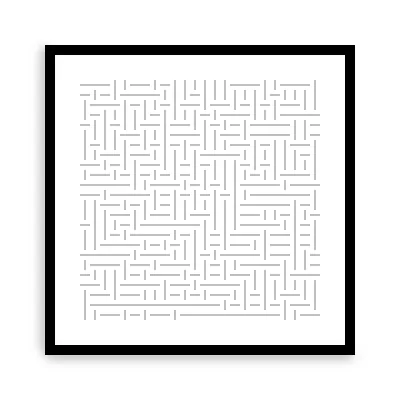</a><br><a href="artworks/p5.js" title="Tribute to Tim Holman: Tiling Lines"><b>Tribute to Tim Holman: Tiling Lines</b></a><br><sub>p5 · tiling</sub></td>
  </tr>
  <tr>
    <td align="center" valign="top" width="33.33%"><a href="artworks/p6.js" title="Tribute to Tim Holman: Displaced Lines">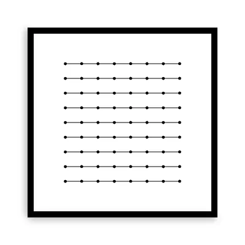</a><br><a href="artworks/p6.js" title="Tribute to Tim Holman: Displaced Lines"><b>Tribute to Tim Holman: Displaced Lines</b></a><br><sub>p6 · geometric</sub></td>
    <td align="center" valign="top" width="33.33%"><a href="artworks/p7.js" title="Tribute to Tim Holman: Jittered Dots">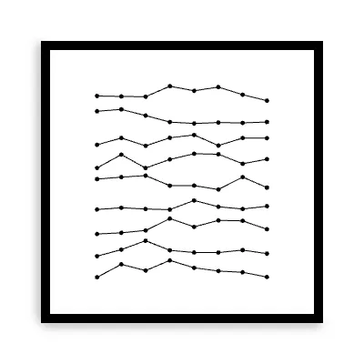</a><br><a href="artworks/p7.js" title="Tribute to Tim Holman: Jittered Dots"><b>Tribute to Tim Holman: Jittered Dots</b></a><br><sub>p7 · geometric</sub></td>
    <td align="center" valign="top" width="33.33%"><a href="artworks/p8.js" title="Tribute to Tim Holman: Displaced Rows">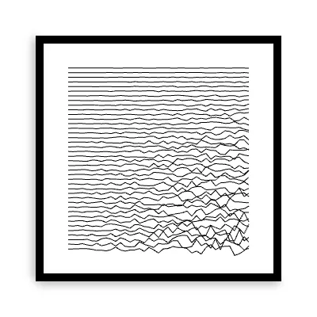</a><br><a href="artworks/p8.js" title="Tribute to Tim Holman: Displaced Rows"><b>Tribute to Tim Holman: Displaced Rows</b></a><br><sub>p8 · generative</sub></td>
  </tr>
  <tr>
    <td align="center" valign="top" width="33.33%"><a href="artworks/p9.js" title="Tribute to Tim Holman: De Casteljau">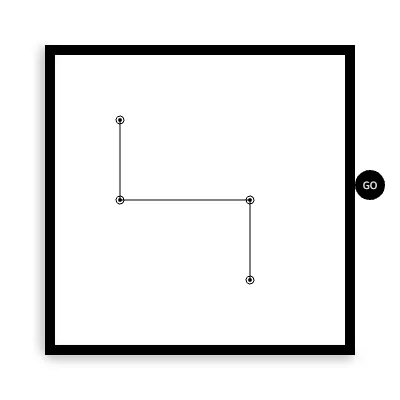</a><br><a href="artworks/p9.js" title="Tribute to Tim Holman: De Casteljau"><b>Tribute to Tim Holman: De Casteljau</b></a><br><sub>p9 · bezier</sub></td>
    <td align="center" valign="top" width="33.33%"><a href="artworks/p10.js" title="Tribute to Tim Holman: Tiling Curves">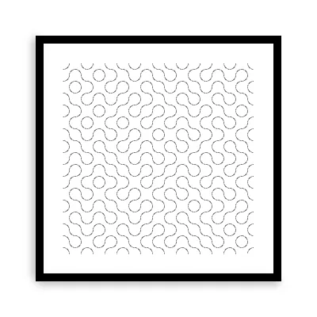</a><br><a href="artworks/p10.js" title="Tribute to Tim Holman: Tiling Curves"><b>Tribute to Tim Holman: Tiling Curves</b></a><br><sub>p10 · tiling</sub></td>
    <td align="center" valign="top" width="33.33%"><a href="artworks/p11.js" title="Tribute to Tim Holman: Noise Curves">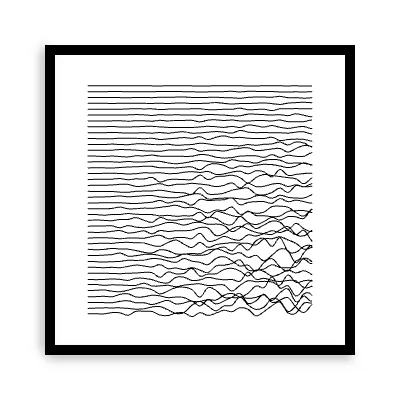</a><br><a href="artworks/p11.js" title="Tribute to Tim Holman: Noise Curves"><b>Tribute to Tim Holman: Noise Curves</b></a><br><sub>p11 · perlin-noise</sub></td>
  </tr>
  <tr>
    <td align="center" valign="top" width="33.33%"><a href="artworks/p12.js" title="Tribute to Peter Saville: Unknown Pleasures">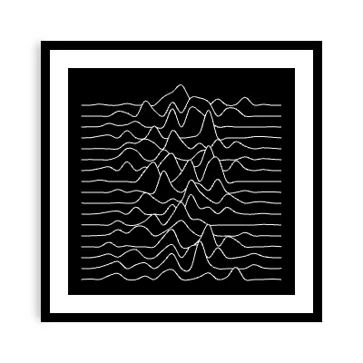</a><br><a href="artworks/p12.js" title="Tribute to Peter Saville: Unknown Pleasures"><b>Tribute to Peter Saville: Unknown Pleasures</b></a><br><sub>p12 · generative</sub></td>
    <td align="center" valign="top" width="33.33%"><a href="artworks/p13.js" title="Tribute to Tim Holman: Drifting Splines">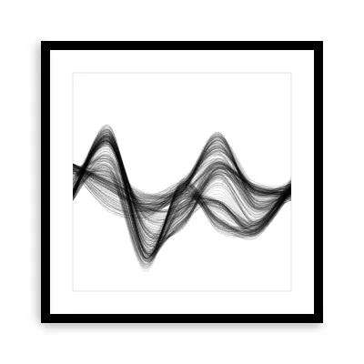</a><br><a href="artworks/p13.js" title="Tribute to Tim Holman: Drifting Splines"><b>Tribute to Tim Holman: Drifting Splines</b></a><br><sub>p13 · generative</sub></td>
    <td align="center" valign="top" width="33.33%"><a href="artworks/p14.js" title="Tribute to Tim Holman: Noise Curtain">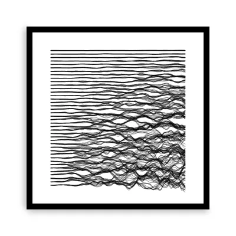</a><br><a href="artworks/p14.js" title="Tribute to Tim Holman: Noise Curtain"><b>Tribute to Tim Holman: Noise Curtain</b></a><br><sub>p14 · flow-field</sub></td>
  </tr>
  <tr>
    <td align="center" valign="top" width="33.33%"><a href="artworks/p15.js" title="Tribute to Tim Holman: Random Tiles">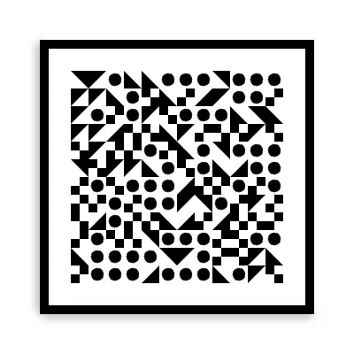</a><br><a href="artworks/p15.js" title="Tribute to Tim Holman: Random Tiles"><b>Tribute to Tim Holman: Random Tiles</b></a><br><sub>p15 · tiling</sub></td>
    <td align="center" valign="top" width="33.33%"><a href="artworks/p16.js" title="Tribute to Tim Holman: Rotated Grid"></a><br><a href="artworks/p16.js" title="Tribute to Tim Holman: Rotated Grid"><b>Tribute to Tim Holman: Rotated Grid</b></a><br><sub>p16 · geometric</sub></td>
    <td align="center" valign="top" width="33.33%"><a href="artworks/p17.js" title="Tribute to Tim Holman: Drifting Curves">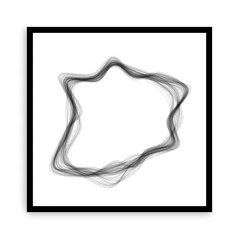</a><br><a href="artworks/p17.js" title="Tribute to Tim Holman: Drifting Curves"><b>Tribute to Tim Holman: Drifting Curves</b></a><br><sub>p17 · generative</sub></td>
  </tr>
  <tr>
    <td align="center" valign="top" width="33.33%"><a href="artworks/p18.js" title="Tribute to Tim Holman: Tile Drift">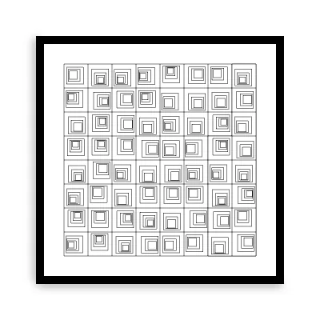</a><br><a href="artworks/p18.js" title="Tribute to Tim Holman: Tile Drift"><b>Tribute to Tim Holman: Tile Drift</b></a><br><sub>p18 · recursion</sub></td>
    <td align="center" valign="top" width="33.33%"><a href="artworks/p19.js" title="Tribute to Tim Holman: Triangle Fractal">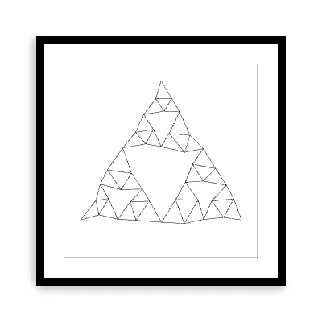</a><br><a href="artworks/p19.js" title="Tribute to Tim Holman: Triangle Fractal"><b>Tribute to Tim Holman: Triangle Fractal</b></a><br><sub>p19 · recursion</sub></td>
    <td align="center" valign="top" width="33.33%"><a href="artworks/p20.js" title="Tribute to Tim Holman: Eye of Sauron">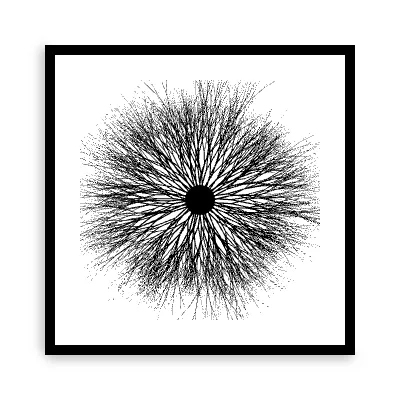</a><br><a href="artworks/p20.js" title="Tribute to Tim Holman: Eye of Sauron"><b>Tribute to Tim Holman: Eye of Sauron</b></a><br><sub>p20 · recursion</sub></td>
  </tr>
  <tr>
    <td align="center" valign="top" width="33.33%"><a href="artworks/p21.js" title="Tribute to Tim Holman: Chromatic Tiles"></a><br><a href="artworks/p21.js" title="Tribute to Tim Holman: Chromatic Tiles"><b>Tribute to Tim Holman: Chromatic Tiles</b></a><br><sub>p21 · tiling</sub></td>
    <td align="center" valign="top" width="33.33%"><a href="artworks/p22.js" title="Tribute to Tim Holman: Twisted Pipes">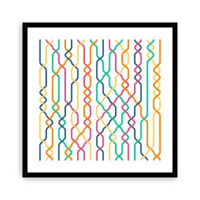</a><br><a href="artworks/p22.js" title="Tribute to Tim Holman: Twisted Pipes"><b>Tribute to Tim Holman: Twisted Pipes</b></a><br><sub>p22 · generative</sub></td>
    <td align="center" valign="top" width="33.33%"><a href="artworks/p23.js" title="Tribute to Tim Holman: Braided Pipes">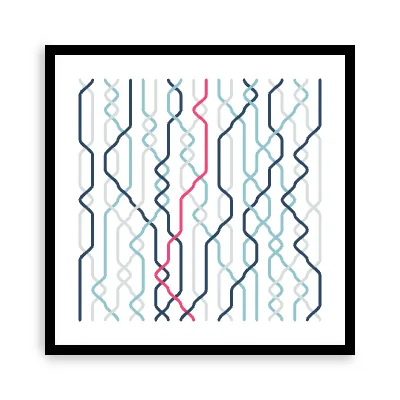</a><br><a href="artworks/p23.js" title="Tribute to Tim Holman: Braided Pipes"><b>Tribute to Tim Holman: Braided Pipes</b></a><br><sub>p23 · generative</sub></td>
  </tr>
  <tr>
    <td align="center" valign="top" width="33.33%"><a href="artworks/p24.js" title="Tribute to Tim Holman: Silky Drift">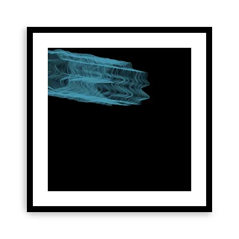</a><br><a href="artworks/p24.js" title="Tribute to Tim Holman: Silky Drift"><b>Tribute to Tim Holman: Silky Drift</b></a><br><sub>p24 · generative</sub></td>
    <td align="center" valign="top" width="33.33%"><a href="artworks/p25.js" title="Tribute to Tim Holman: Fractal Circles">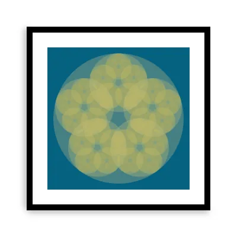</a><br><a href="artworks/p25.js" title="Tribute to Tim Holman: Fractal Circles"><b>Tribute to Tim Holman: Fractal Circles</b></a><br><sub>p25 · fractal</sub></td>
    <td align="center" valign="top" width="33.33%"><a href="artworks/p26.js" title="Tribute to Tim Holman: Flow Field">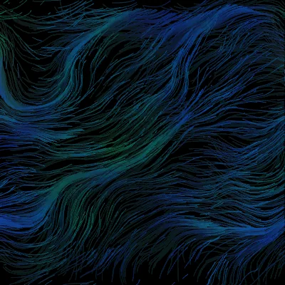</a><br><a href="artworks/p26.js" title="Tribute to Tim Holman: Flow Field"><b>Tribute to Tim Holman: Flow Field</b></a><br><sub>p26 · flow-field</sub></td>
  </tr>
  <tr>
    <td align="center" valign="top" width="33.33%"><a href="artworks/p27.js" title="Tribute to Leonardo da Vinci: Mona Lisa">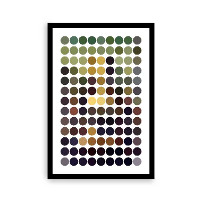</a><br><a href="artworks/p27.js" title="Tribute to Leonardo da Vinci: Mona Lisa"><b>Tribute to Leonardo da Vinci: Mona Lisa</b></a><br><sub>p27 · halftone</sub></td>
    <td align="center" valign="top" width="33.33%"><a href="artworks/p28.js" title="Tribute to Leonardo da Vinci: Mona Lisa">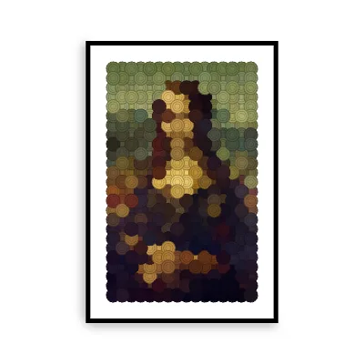</a><br><a href="artworks/p28.js" title="Tribute to Leonardo da Vinci: Mona Lisa"><b>Tribute to Leonardo da Vinci: Mona Lisa</b></a><br><sub>p28 · image-sampling</sub></td>
    <td align="center" valign="top" width="33.33%"><a href="artworks/p29.js" title="Tribute to Leonardo da Vinci: Mona Lisa">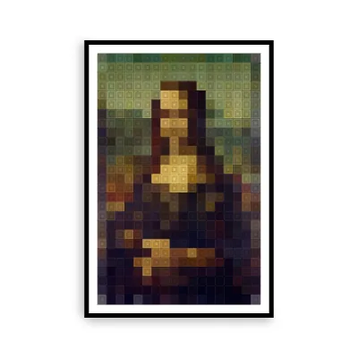</a><br><a href="artworks/p29.js" title="Tribute to Leonardo da Vinci: Mona Lisa"><b>Tribute to Leonardo da Vinci: Mona Lisa</b></a><br><sub>p29 · pixel-art</sub></td>
  </tr>
  <tr>
    <td align="center" valign="top" width="33.33%"><a href="artworks/p30.js" title="Tribute to Tim Holman: Audio Spectrum">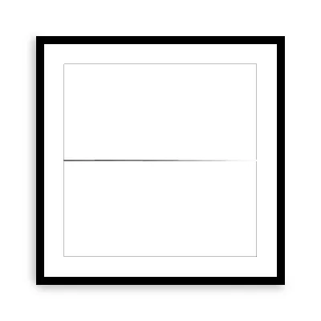</a><br><a href="artworks/p30.js" title="Tribute to Tim Holman: Audio Spectrum"><b>Tribute to Tim Holman: Audio Spectrum</b></a><br><sub>p30 · audio</sub></td>
    <td align="center" valign="top" width="33.33%"><a href="artworks/p31.js" title="Tribute to Jane Street: Logo"></a><br><a href="artworks/p31.js" title="Tribute to Jane Street: Logo"><b>Tribute to Jane Street: Logo</b></a><br><sub>p31 · geometric</sub></td>
    <td align="center" valign="top" width="33.33%"><a href="artworks/p32.js" title="Tribute to Kazuki Umeda: 3D Mathematical Flowers">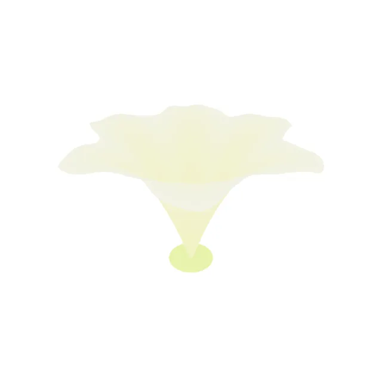</a><br><a href="artworks/p32.js" title="Tribute to Kazuki Umeda: 3D Mathematical Flowers"><b>Tribute to Kazuki Umeda: 3D Mathematical Flowers</b></a><br><sub>p32 · webgl</sub></td>
  </tr>
  <tr>
    <td align="center" valign="top" width="33.33%"><a href="artworks/p33.js" title="Tribute to Kazuki Umeda: Camellia">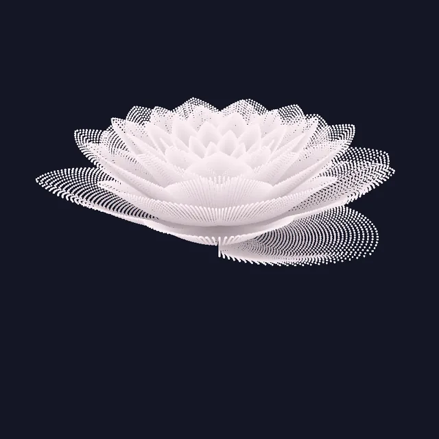</a><br><a href="artworks/p33.js" title="Tribute to Kazuki Umeda: Camellia"><b>Tribute to Kazuki Umeda: Camellia</b></a><br><sub>p33 · webgl</sub></td>
    <td align="center" valign="top" width="33.33%"><a href="artworks/p34.js" title="Tribute to Kazuki Umeda: Camellia Tetrahedron">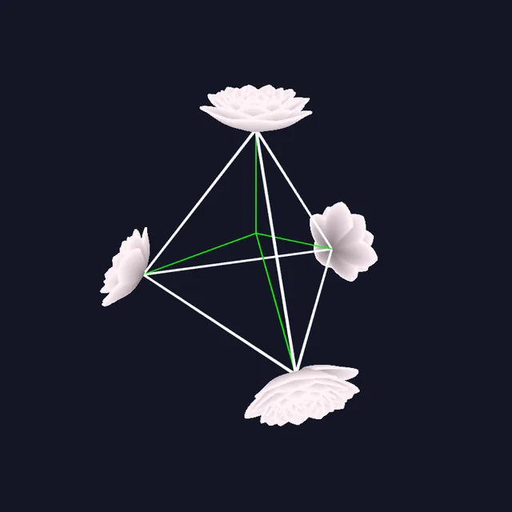</a><br><a href="artworks/p34.js" title="Tribute to Kazuki Umeda: Camellia Tetrahedron"><b>Tribute to Kazuki Umeda: Camellia Tetrahedron</b></a><br><sub>p34 · webgl</sub></td>
    <td align="center" valign="top" width="33.33%"><a href="artworks/p35.js" title="Tribute to Calico: Logo"></a><br><a href="artworks/p35.js" title="Tribute to Calico: Logo"><b>Tribute to Calico: Logo</b></a><br><sub>p35 · logo</sub></td>
  </tr>
  <tr>
    <td align="center" valign="top" width="33.33%"><a href="artworks/p36.js" title="Pavilion on Fire">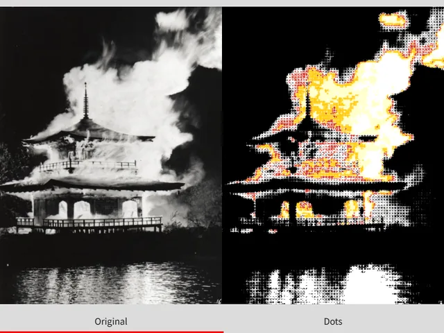</a><br><a href="artworks/p36.js" title="Pavilion on Fire"><b>Pavilion on Fire</b></a><br><sub>p36 · halftone</sub></td>
    <td align="center" valign="top" width="33.33%"><a href="artworks/p37.js" title="Dystrophin Poster">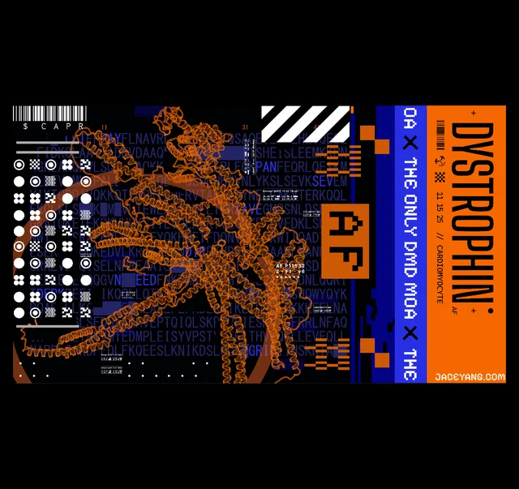</a><br><a href="artworks/p37.js" title="Dystrophin Poster"><b>Dystrophin Poster</b></a><br><sub>p37 · image</sub></td>
    <td align="center" valign="top" width="33.33%"><a href="artworks/p38.js" title="Tribute to John Walker: Six Grids, Five Folds">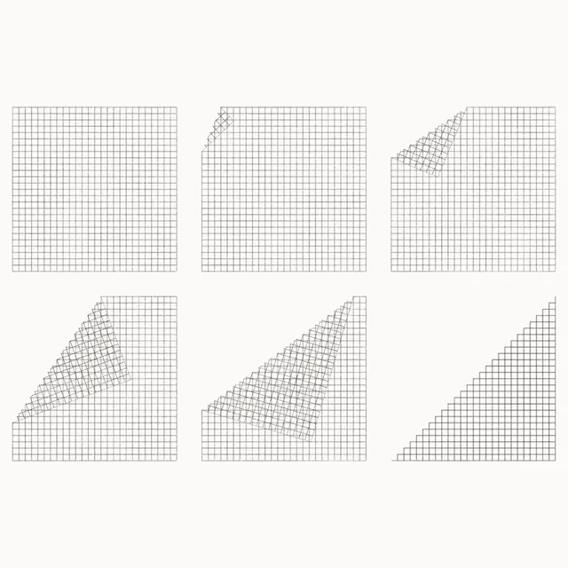</a><br><a href="artworks/p38.js" title="Tribute to John Walker: Six Grids, Five Folds"><b>Tribute to John Walker: Six Grids, Five Folds</b></a><br><sub>p38 · after John Walker, 2008</sub></td>
  </tr>
  <tr>
    <td align="center" valign="top" width="33.33%"><a href="artworks/p39.js" title="Tribute to John Walker: Folding Grid">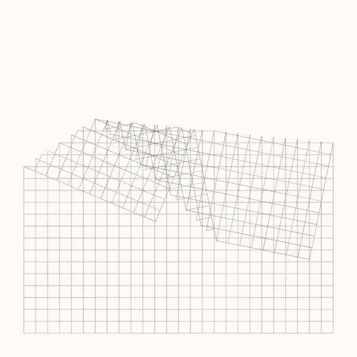</a><br><a href="artworks/p39.js" title="Tribute to John Walker: Folding Grid"><b>Tribute to John Walker: Folding Grid</b></a><br><sub>p39 · geometric</sub></td>
    <td align="center" valign="top" width="33.33%"><a href="artworks/p40.js" title="Tribute to Sol LeWitt: Vanish">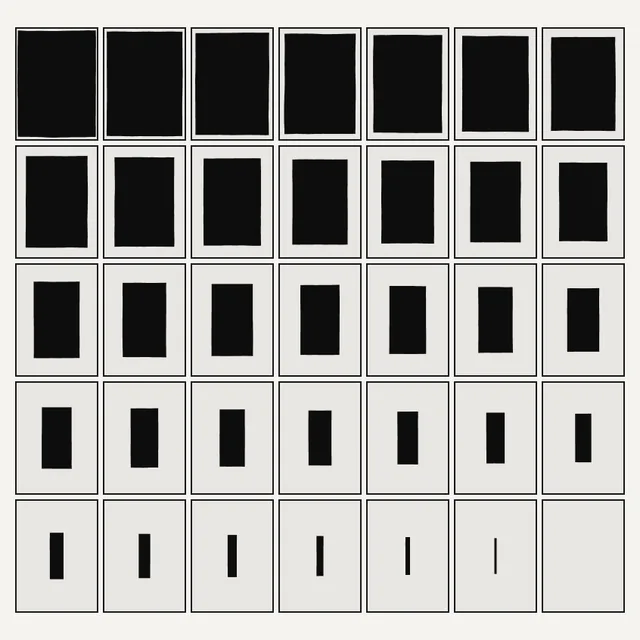</a><br><a href="artworks/p40.js" title="Tribute to Sol LeWitt: Vanish"><b>Tribute to Sol LeWitt: Vanish</b></a><br><sub>p40 · after Sol LeWitt, 1994</sub></td>
    <td align="center" valign="top" width="33.33%"><a href="artworks/p41.js" title="Tribute to Sol LeWitt: Unknown"></a><br><a href="artworks/p41.js" title="Tribute to Sol LeWitt: Unknown"><b>Tribute to Sol LeWitt: Unknown</b></a><br><sub>p41 · after Sol LeWitt</sub></td>
  </tr>
  <tr>
    <td align="center" valign="top" width="33.33%"><a href="artworks/p42.js" title="Tribute to Sol LeWitt: Wall Drawing #821">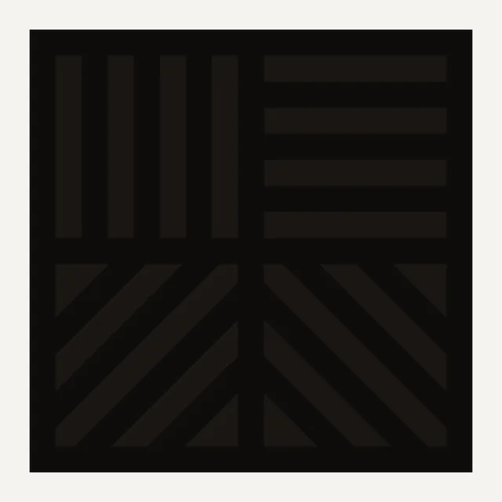</a><br><a href="artworks/p42.js" title="Tribute to Sol LeWitt: Wall Drawing #821"><b>Tribute to Sol LeWitt: Wall Drawing #821</b></a><br><sub>p42 · after Sol LeWitt, 1997</sub></td>
    <td align="center" valign="top" width="33.33%"><a href="artworks/p43.js" title="Tribute to Ad Reinhardt: Abstract Painting, Blue">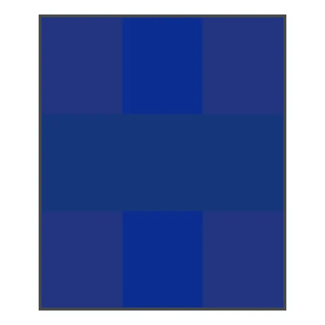</a><br><a href="artworks/p43.js" title="Tribute to Ad Reinhardt: Abstract Painting, Blue"><b>Tribute to Ad Reinhardt: Abstract Painting, Blue</b></a><br><sub>p43 · after Ad Reinhardt, 1953</sub></td>
    <td align="center" valign="top" width="33.33%"><a href="artworks/p44.js" title="Tribute to Ad Reinhardt: Abstract Painting">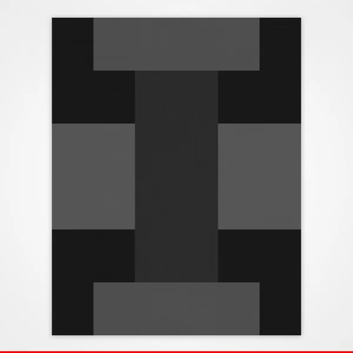</a><br><a href="artworks/p44.js" title="Tribute to Ad Reinhardt: Abstract Painting"><b>Tribute to Ad Reinhardt: Abstract Painting</b></a><br><sub>p44 · after Ad Reinhardt, 1960s</sub></td>
  </tr>
  <tr>
    <td align="center" valign="top" width="33.33%"><a href="artworks/p45.js" title="Tribute to Anthropic: Basic Shapes">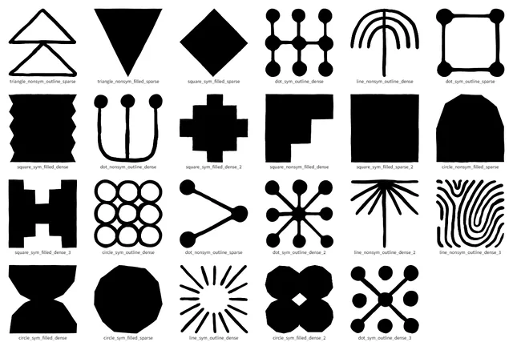</a><br><a href="artworks/p45.js" title="Tribute to Anthropic: Basic Shapes"><b>Tribute to Anthropic: Basic Shapes</b></a><br><sub>p45 · grid</sub></td>
    <td align="center" valign="top" width="33.33%"><a href="artworks/p46.js" title="Seven Colors">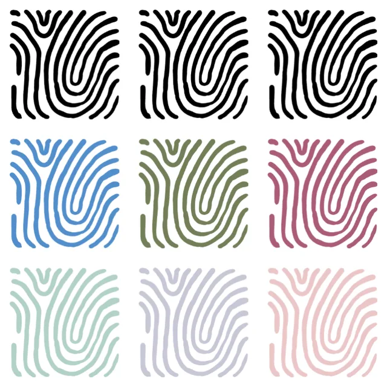</a><br><a href="artworks/p46.js" title="Seven Colors"><b>Seven Colors</b></a><br><sub>p46 · grid</sub></td>
    <td align="center" valign="top" width="33.33%"><a href="artworks/p47.js" title="Accent Block Grid">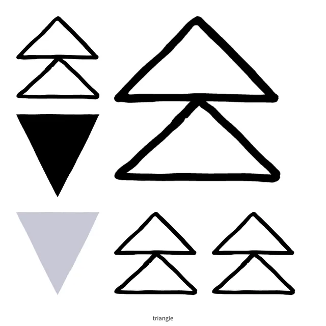</a><br><a href="artworks/p47.js" title="Accent Block Grid"><b>Accent Block Grid</b></a><br><sub>p47 · grid</sub></td>
  </tr>
  <tr>
    <td align="center" valign="top" width="33.33%"><a href="artworks/p48.js" title="Shape Browser">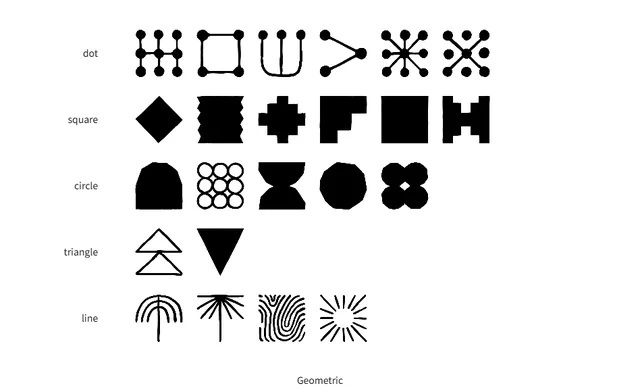</a><br><a href="artworks/p48.js" title="Shape Browser"><b>Shape Browser</b></a><br><sub>p48 · svg</sub></td>
    <td align="center" valign="top" width="33.33%"><a href="artworks/p49.js" title="2×2 Block Grid">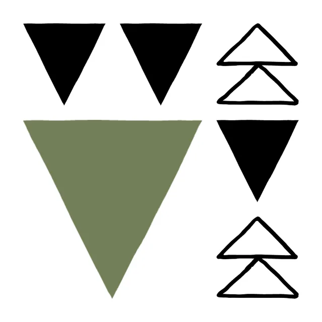</a><br><a href="artworks/p49.js" title="2×2 Block Grid"><b>2×2 Block Grid</b></a><br><sub>p49 · grid</sub></td>
    <td align="center" valign="top" width="33.33%"><a href="artworks/p50.js" title="Color Accent Grid">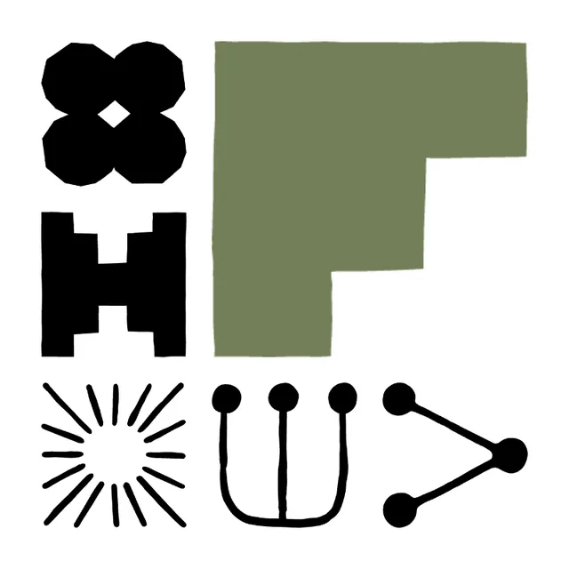</a><br><a href="artworks/p50.js" title="Color Accent Grid"><b>Color Accent Grid</b></a><br><sub>p50 · grid</sub></td>
  </tr>
  <tr>
    <td align="center" valign="top" width="33.33%"><a href="artworks/p51.js" title="Shape Mosaic">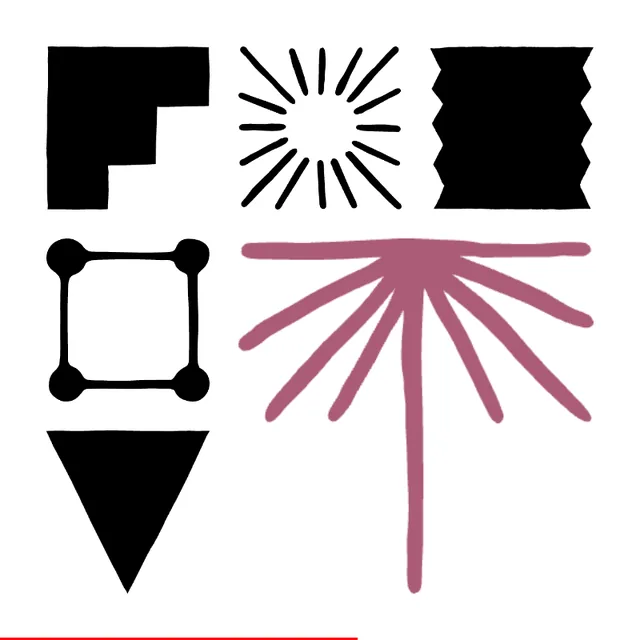</a><br><a href="artworks/p51.js" title="Shape Mosaic"><b>Shape Mosaic</b></a><br><sub>p51 · geometric</sub></td>
    <td align="center" valign="top" width="33.33%"><a href="artworks/p52.js" title="18 Compositions">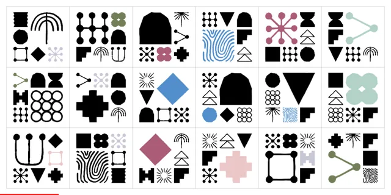</a><br><a href="artworks/p52.js" title="18 Compositions"><b>18 Compositions</b></a><br><sub>p52 · grid</sub></td>
    <td align="center" valign="top" width="33.33%"><a href="artworks/p53.js" title="Six Compositions">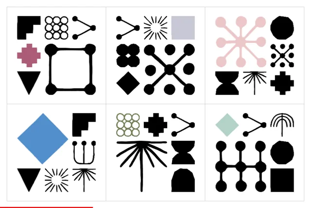</a><br><a href="artworks/p53.js" title="Six Compositions"><b>Six Compositions</b></a><br><sub>p53 · grid</sub></td>
  </tr>
  <tr>
    <td align="center" valign="top" width="33.33%"><a href="artworks/p54.js" title="Shape Collage">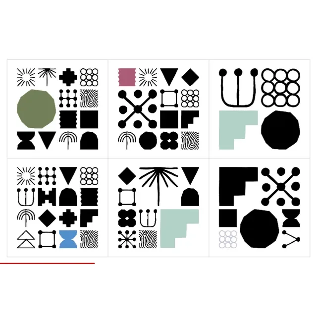</a><br><a href="artworks/p54.js" title="Shape Collage"><b>Shape Collage</b></a><br><sub>p54 · grid</sub></td>
    <td align="center" valign="top" width="33.33%"><a href="artworks/p55.js" title="Density Gradient">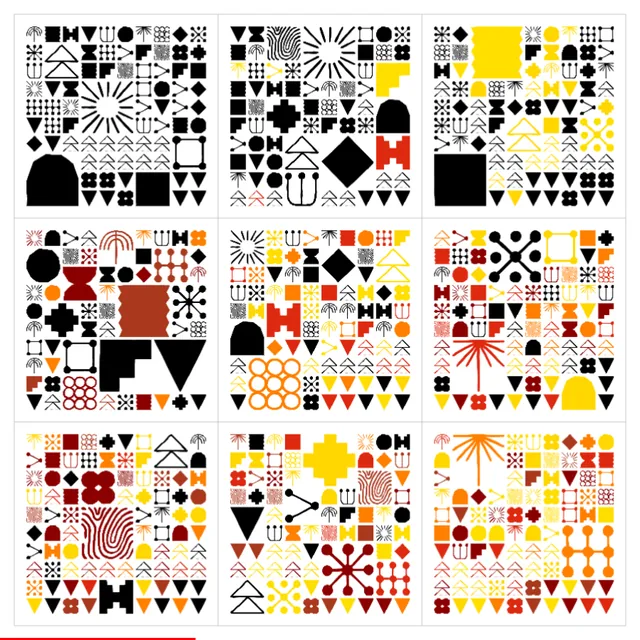</a><br><a href="artworks/p55.js" title="Density Gradient"><b>Density Gradient</b></a><br><sub>p55 · grid</sub></td>
    <td align="center" valign="top" width="33.33%"><a href="artworks/p56.js" title="Scale &amp; Overlap">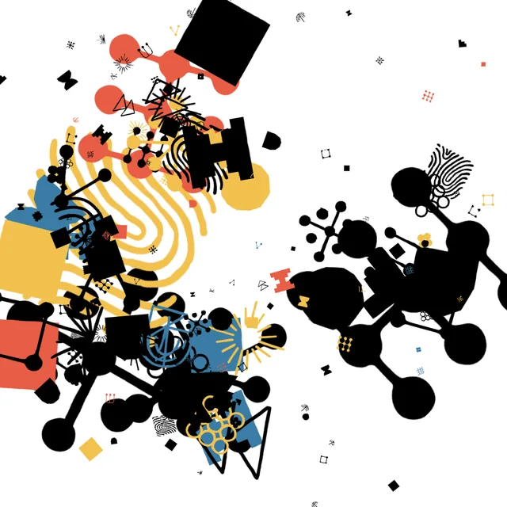</a><br><a href="artworks/p56.js" title="Scale &amp; Overlap"><b>Scale &amp; Overlap</b></a><br><sub>p56 · collage</sub></td>
  </tr>
  <tr>
    <td align="center" valign="top" width="33.33%"><a href="artworks/p57.js" title="Tribute to Georg Nees: Schotter">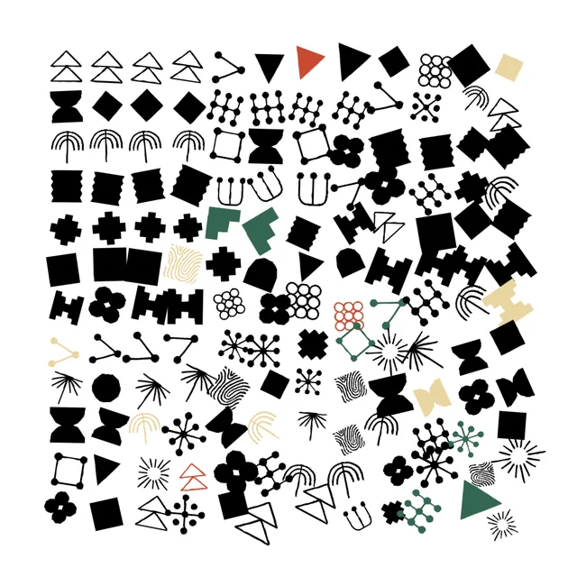</a><br><a href="artworks/p57.js" title="Tribute to Georg Nees: Schotter"><b>Tribute to Georg Nees: Schotter</b></a><br><sub>p57 · grid</sub></td>
    <td align="center" valign="top" width="33.33%"><a href="artworks/p58.js" title="Shape Packing">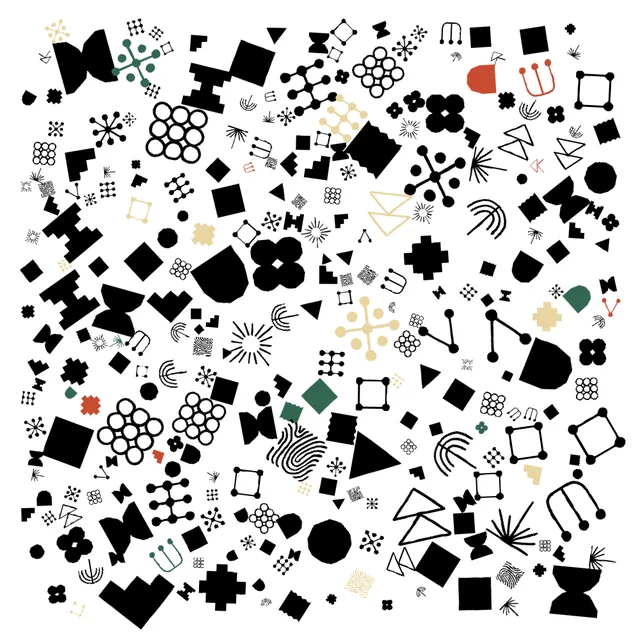</a><br><a href="artworks/p58.js" title="Shape Packing"><b>Shape Packing</b></a><br><sub>p58 · packing</sub></td>
    <td align="center" valign="top" width="33.33%"><a href="artworks/p59.js" title="Tribute to Piet Mondrian: Recursive Subdivision">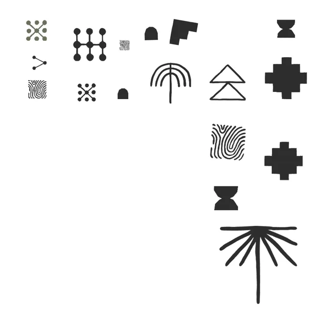</a><br><a href="artworks/p59.js" title="Tribute to Piet Mondrian: Recursive Subdivision"><b>Tribute to Piet Mondrian: Recursive Subdivision</b></a><br><sub>p59 · recursion</sub></td>
  </tr>
  <tr>
    <td align="center" valign="top" width="33.33%"><a href="artworks/p60.js" title="Radial Ripples">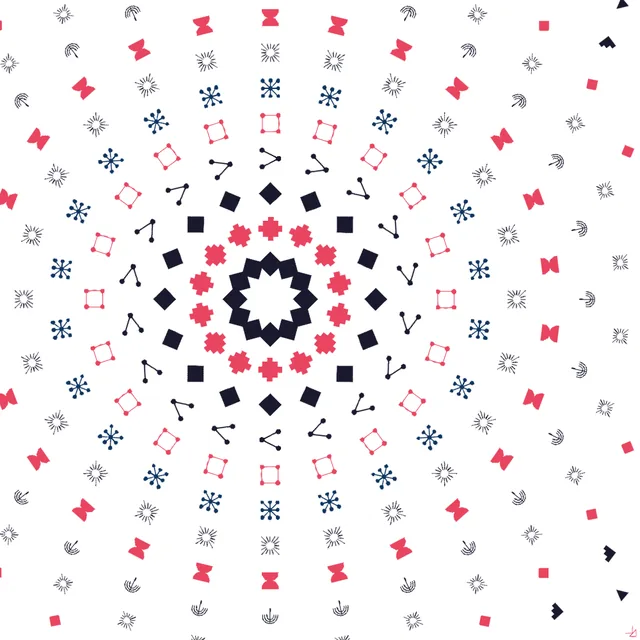</a><br><a href="artworks/p60.js" title="Radial Ripples"><b>Radial Ripples</b></a><br><sub>p60 · concentric</sub></td>
    <td align="center" valign="top" width="33.33%"><a href="artworks/p61.js" title="Tribute to Pixel Symphony: Converging Grid"></a><br><a href="artworks/p61.js" title="Tribute to Pixel Symphony: Converging Grid"><b>Tribute to Pixel Symphony: Converging Grid</b></a><br><sub>p61 · after Pixel Symphony</sub></td>
    <td align="center" valign="top" width="33.33%"><a href="artworks/p62.js" title="Tribute to Unknown: Digital Access Card">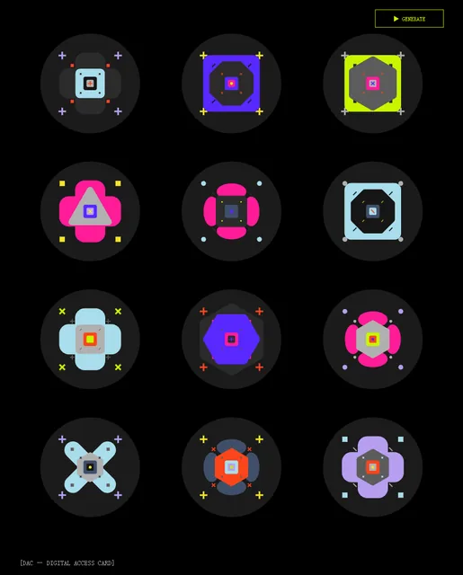</a><br><a href="artworks/p62.js" title="Tribute to Unknown: Digital Access Card"><b>Tribute to Unknown: Digital Access Card</b></a><br><sub>p62 · generative</sub></td>
  </tr>
  <tr>
    <td align="center" valign="top" width="33.33%"><a href="artworks/p63.js" title="Cathedral Glass">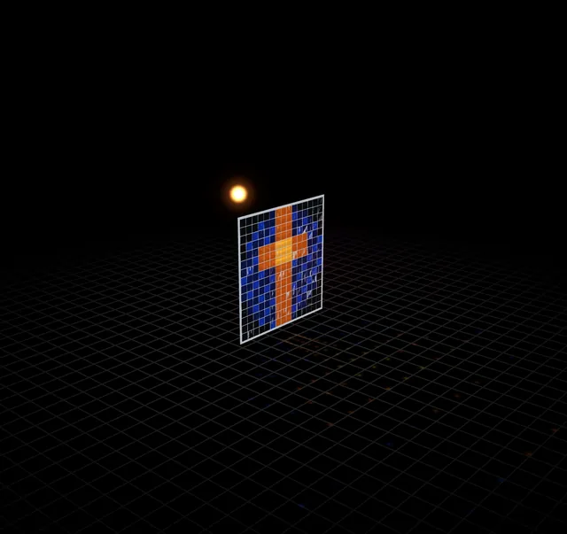</a><br><a href="artworks/p63.js" title="Cathedral Glass"><b>Cathedral Glass</b></a><br><sub>p63 · three.js</sub></td>
    <td align="center" valign="top" width="33.33%"><a href="artworks/p64.js" title="God-Ray Falloff"></a><br><a href="artworks/p64.js" title="God-Ray Falloff"><b>God-Ray Falloff</b></a><br><sub>p64 · three.js</sub></td>
    <td align="center" valign="top" width="33.33%"><a href="artworks/p66.js" title="Leaded Glass Dome">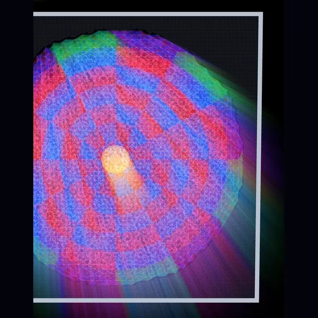</a><br><a href="artworks/p66.js" title="Leaded Glass Dome"><b>Leaded Glass Dome</b></a><br><sub>p66 · three.js</sub></td>
  </tr>
  <tr>
    <td align="center" valign="top" width="33.33%"><a href="artworks/p67.js" title="Tribute to Vera Molnár: 3 carrés noirs, 3 rectangles gris, 5 rectangles bleus">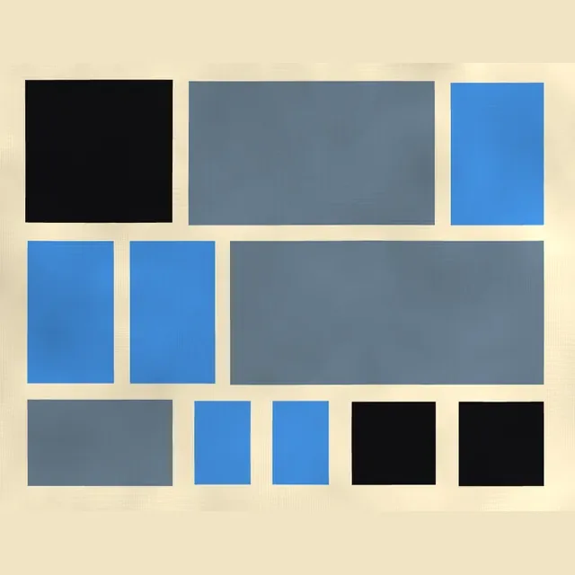</a><br><a href="artworks/p67.js" title="Tribute to Vera Molnár: 3 carrés noirs, 3 rectangles gris, 5 rectangles bleus"><b>Tribute to Vera Molnár: 3 carrés noirs, 3 rectangles gris, 5 rectangles bleus</b></a><br><sub>p67 · after Vera Molnár, 1950</sub></td>
    <td align="center" valign="top" width="33.33%"><a href="artworks/p68.js" title="Tribute to Milan Dobeš: Central Gravity"></a><br><a href="artworks/p68.js" title="Tribute to Milan Dobeš: Central Gravity"><b>Tribute to Milan Dobeš: Central Gravity</b></a><br><sub>p68 · after Milan Dobeš, 1965</sub></td>
    <td align="center" valign="top" width="33.33%"><a href="artworks/p69.js" title="Tribute to Julio Le Parc: Double Progression">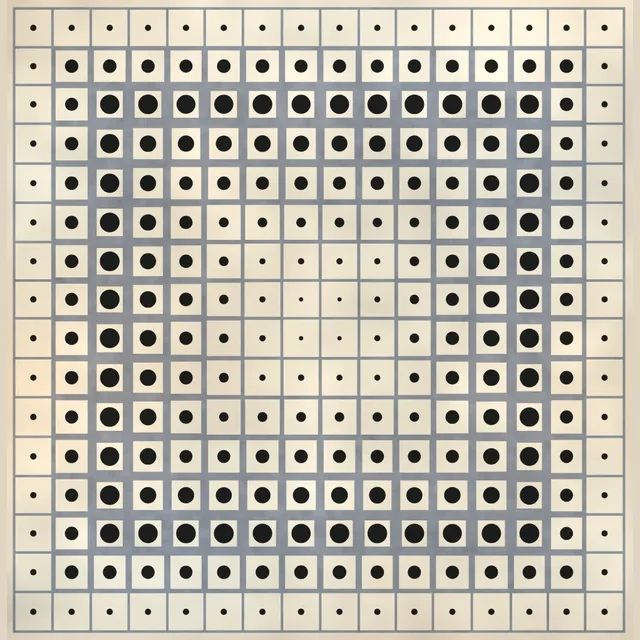</a><br><a href="artworks/p69.js" title="Tribute to Julio Le Parc: Double Progression"><b>Tribute to Julio Le Parc: Double Progression</b></a><br><sub>p69 · after Julio Le Parc, 1959</sub></td>
  </tr>
  <tr>
    <td align="center" valign="top" width="33.33%"><a href="artworks/p70.js" title="Tribute to Horacio García Rossi: Brix">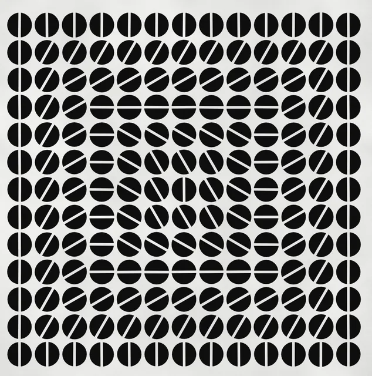</a><br><a href="artworks/p70.js" title="Tribute to Horacio García Rossi: Brix"><b>Tribute to Horacio García Rossi: Brix</b></a><br><sub>p70 · after Horacio García Rossi, 1959</sub></td>
    <td align="center" valign="top" width="33.33%"><a href="artworks/p71.js" title="Tribute to Anton Stankowski: Equal and Unequal">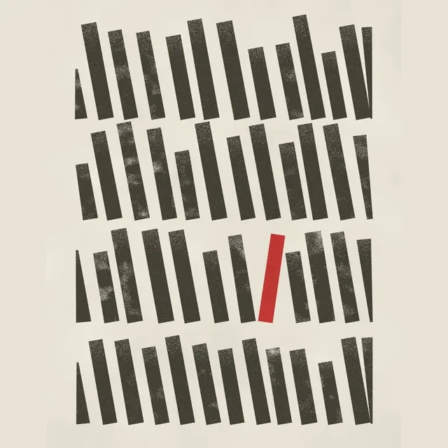</a><br><a href="artworks/p71.js" title="Tribute to Anton Stankowski: Equal and Unequal"><b>Tribute to Anton Stankowski: Equal and Unequal</b></a><br><sub>p71 · after Anton Stankowski, 1951</sub></td>
    <td align="center" valign="top" width="33.33%"><a href="artworks/p72.js" title="Tribute to Luiz Sacilotto: Untitled">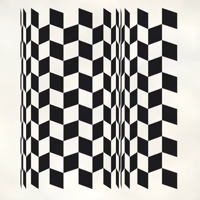</a><br><a href="artworks/p72.js" title="Tribute to Luiz Sacilotto: Untitled"><b>Tribute to Luiz Sacilotto: Untitled</b></a><br><sub>p72 · after Luiz Sacilotto, 1978</sub></td>
  </tr>
  <tr>
    <td align="center" valign="top" width="33.33%"><a href="artworks/p73.js" title="Tribute to Victor Vasarely: Symphonie Inachevée">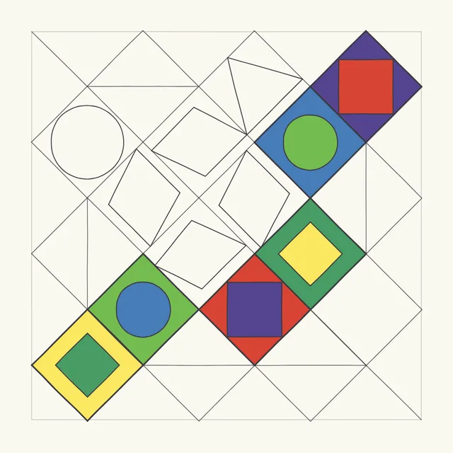</a><br><a href="artworks/p73.js" title="Tribute to Victor Vasarely: Symphonie Inachevée"><b>Tribute to Victor Vasarely: Symphonie Inachevée</b></a><br><sub>p73 · after Victor Vasarely, 1966</sub></td>
    <td align="center" valign="top" width="33.33%"><a href="artworks/p74.js" title="Tribute to Germaine Derbecq: Multiple Painting (Series 14 No. 1)">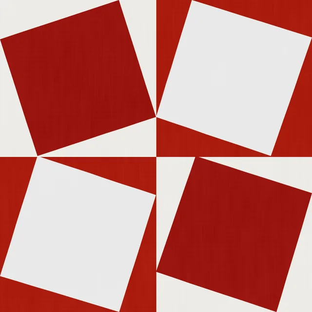</a><br><a href="artworks/p74.js" title="Tribute to Germaine Derbecq: Multiple Painting (Series 14 No. 1)"><b>Tribute to Germaine Derbecq: Multiple Painting (Series 14 No. 1)</b></a><br><sub>p74 · after Germaine Derbecq, 1969</sub></td>
    <td align="center" valign="top" width="33.33%"><a href="artworks/p75.js" title="Tribute to Marcello Morandini: 34">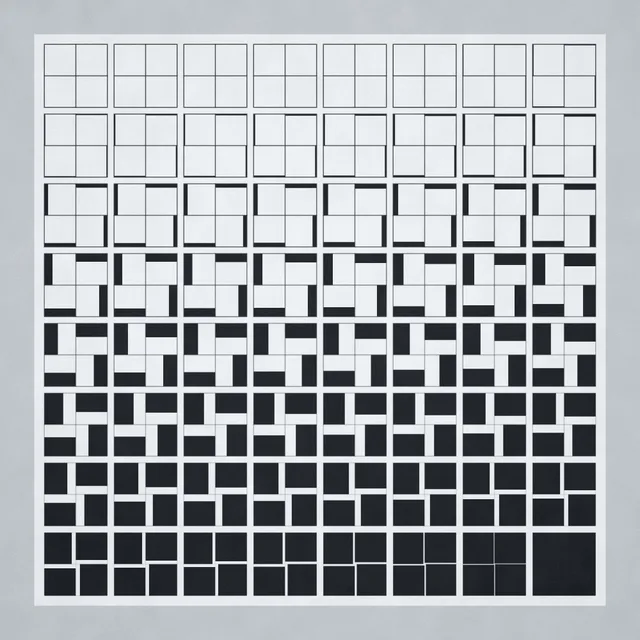</a><br><a href="artworks/p75.js" title="Tribute to Marcello Morandini: 34"><b>Tribute to Marcello Morandini: 34</b></a><br><sub>p75 · after Marcello Morandini, 1968</sub></td>
  </tr>
  <tr>
    <td align="center" valign="top" width="33.33%"><a href="artworks/p76.js" title="Tribute to Elena Asins: LAKH 22 VARZ">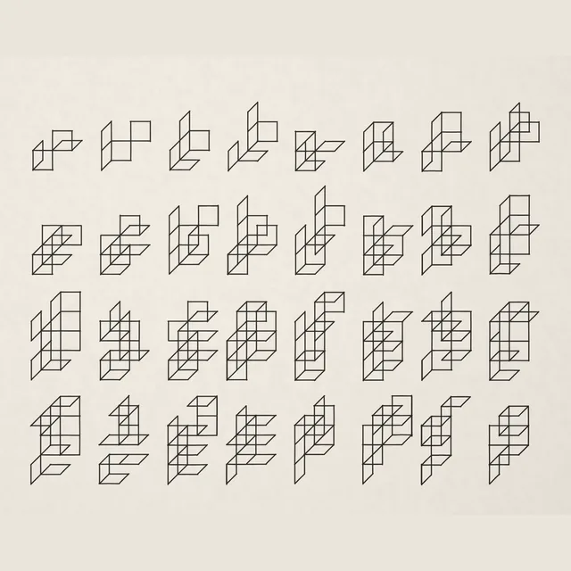</a><br><a href="artworks/p76.js" title="Tribute to Elena Asins: LAKH 22 VARZ"><b>Tribute to Elena Asins: LAKH 22 VARZ</b></a><br><sub>p76 · after Elena Asins, 1991</sub></td>
    <td align="center" valign="top" width="33.33%"><a href="artworks/p77.js" title="Tribute to Kishio Suga: Untitled (無題)">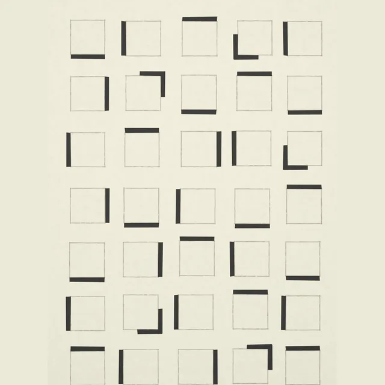</a><br><a href="artworks/p77.js" title="Tribute to Kishio Suga: Untitled (無題)"><b>Tribute to Kishio Suga: Untitled (無題)</b></a><br><sub>p77 · after Kishio Suga, 1975</sub></td>
    <td align="center" valign="top" width="33.33%"><a href="artworks/p78.js" title="Tribute to Theo van Doesburg: Composition">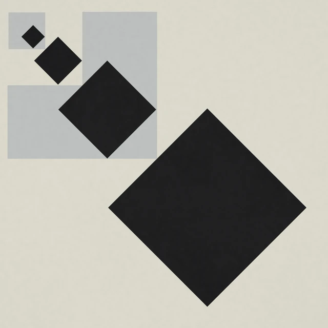</a><br><a href="artworks/p78.js" title="Tribute to Theo van Doesburg: Composition"><b>Tribute to Theo van Doesburg: Composition</b></a><br><sub>p78 · after Theo van Doesburg, c. 1920s</sub></td>
  </tr>
  <tr>
    <td align="center" valign="top" width="33.33%"><a href="artworks/p79.js" title="Tribute to Vera Molnár: Ascension">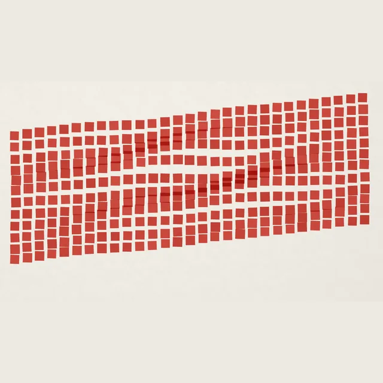</a><br><a href="artworks/p79.js" title="Tribute to Vera Molnár: Ascension"><b>Tribute to Vera Molnár: Ascension</b></a><br><sub>p79 · after Vera Molnár, 1984</sub></td>
    <td align="center" valign="top" width="33.33%"><a href="artworks/p80.js" title="Tribute to Agnes Martin: Summer">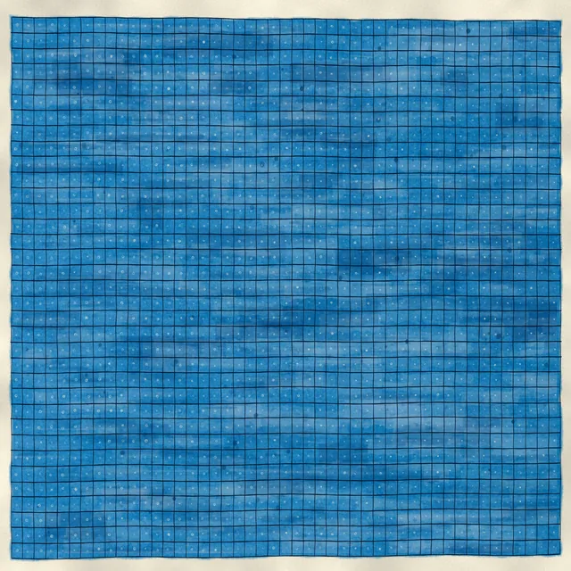</a><br><a href="artworks/p80.js" title="Tribute to Agnes Martin: Summer"><b>Tribute to Agnes Martin: Summer</b></a><br><sub>p80 · after Agnes Martin, 1964</sub></td>
    <td align="center" valign="top" width="33.33%"><a href="artworks/p81.js" title="Tribute to Agnes Martin: The Lamp">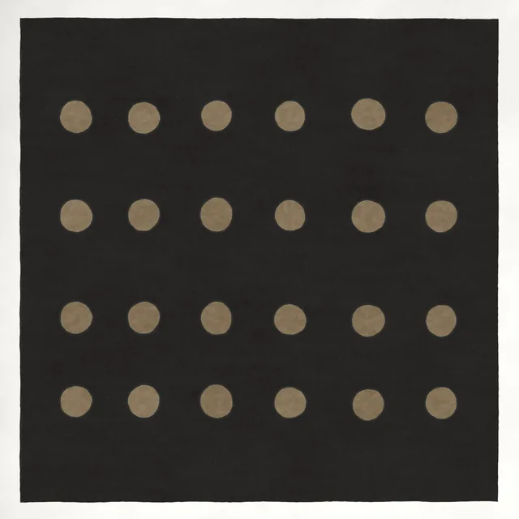</a><br><a href="artworks/p81.js" title="Tribute to Agnes Martin: The Lamp"><b>Tribute to Agnes Martin: The Lamp</b></a><br><sub>p81 · after Agnes Martin, 1959</sub></td>
  </tr>
  <tr>
    <td align="center" valign="top" width="33.33%"><a href="artworks/p82.js" title="Tribute to Agnes Martin: Untitled">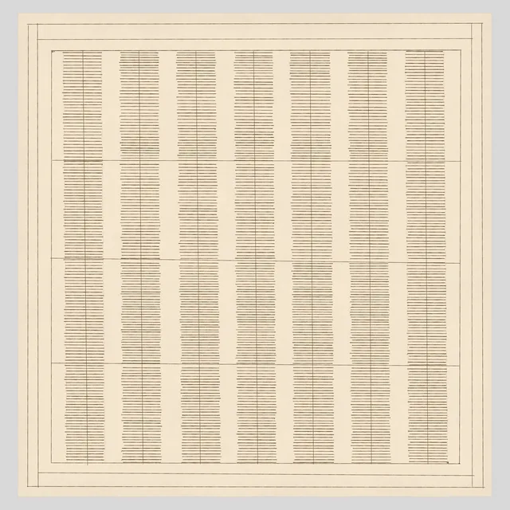</a><br><a href="artworks/p82.js" title="Tribute to Agnes Martin: Untitled"><b>Tribute to Agnes Martin: Untitled</b></a><br><sub>p82 · after Agnes Martin, 1960</sub></td>
    <td align="center" valign="top" width="33.33%"><a href="artworks/p83.js" title="Tribute to Agnes Martin: The Islands">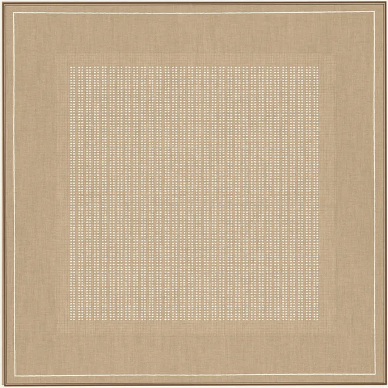</a><br><a href="artworks/p83.js" title="Tribute to Agnes Martin: The Islands"><b>Tribute to Agnes Martin: The Islands</b></a><br><sub>p83 · after Agnes Martin, 1961</sub></td>
    <td align="center" valign="top" width="33.33%"><a href="artworks/p84.js" title="Tribute to Agnes Martin: Starlight">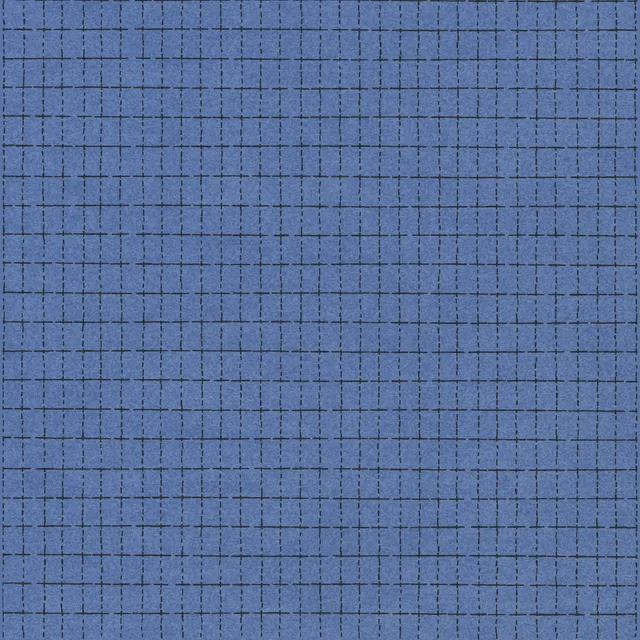</a><br><a href="artworks/p84.js" title="Tribute to Agnes Martin: Starlight"><b>Tribute to Agnes Martin: Starlight</b></a><br><sub>p84 · after Agnes Martin, 1963</sub></td>
  </tr>
  <tr>
    <td align="center" valign="top" width="33.33%"><a href="artworks/p85.js" title="Tribute to Agnes Martin: With My Back to the World">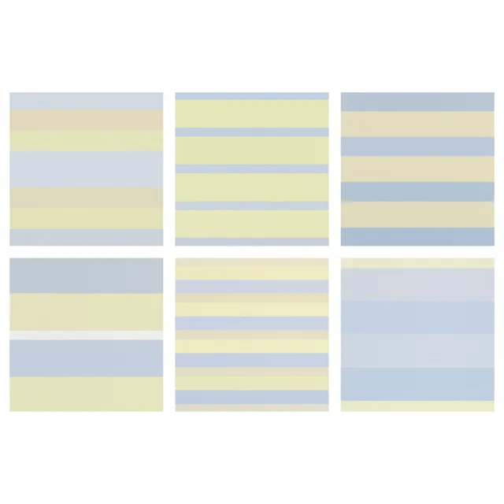</a><br><a href="artworks/p85.js" title="Tribute to Agnes Martin: With My Back to the World"><b>Tribute to Agnes Martin: With My Back to the World</b></a><br><sub>p85 · after Agnes Martin, 1997</sub></td>
    <td align="center" valign="top" width="33.33%"><a href="artworks/p86.js" title="Tribute to Agnes Martin: Untitled #6">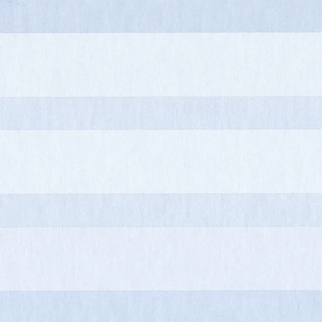</a><br><a href="artworks/p86.js" title="Tribute to Agnes Martin: Untitled #6"><b>Tribute to Agnes Martin: Untitled #6</b></a><br><sub>p86 · after Agnes Martin, 2003</sub></td>
  </tr>
</table>

---

<details>
<summary><b>References</b></summary>

<br>

The archive includes recreations, tutorial studies, and style tributes. The original artist or source author is credited in each tribute title. Source details and study variations are recorded in [`artworks/catalog.json`](artworks/catalog.json). Selected artwork references:

- **Tribute to John Walker: Six Grids, Five Folds** — after John Walker, 2008 &nbsp;`p38`
- **Tribute to Sol LeWitt: Vanish** — after Sol LeWitt, 1994 &nbsp;`p40`
- **Tribute to Sol LeWitt: Unknown** — after Sol LeWitt &nbsp;`p41`
- **Tribute to Sol LeWitt: Wall Drawing #821** — after Sol LeWitt, 1997 &nbsp;`p42`
- **Tribute to Ad Reinhardt: Abstract Painting, Blue** — after Ad Reinhardt, 1953 &nbsp;`p43`
- **Tribute to Ad Reinhardt: Abstract Painting** — after Ad Reinhardt, 1960s &nbsp;`p44`
- **Tribute to Pixel Symphony: Converging Grid** — after Pixel Symphony &nbsp;`p61`
- **Tribute to Vera Molnár: 3 carrés noirs, 3 rectangles gris, 5 rectangles bleus** — after Vera Molnár, 1950 &nbsp;`p67`
- **Tribute to Milan Dobeš: Central Gravity** — after Milan Dobeš, 1965 &nbsp;`p68`
- **Tribute to Julio Le Parc: Double Progression** — after Julio Le Parc, 1959 &nbsp;`p69`
- **Tribute to Horacio García Rossi: Brix** — after Horacio García Rossi, 1959 &nbsp;`p70`
- **Tribute to Anton Stankowski: Equal and Unequal** — after Anton Stankowski, 1951 &nbsp;`p71`
- **Tribute to Luiz Sacilotto: Untitled** — after Luiz Sacilotto, 1978 &nbsp;`p72`
- **Tribute to Victor Vasarely: Symphonie Inachevée** — after Victor Vasarely, 1966 &nbsp;`p73`
- **Tribute to Germaine Derbecq: Multiple Painting (Series 14 No. 1)** — after Germaine Derbecq, 1969 &nbsp;`p74`
- **Tribute to Marcello Morandini: 34** — after Marcello Morandini, 1968 &nbsp;`p75`
- **Tribute to Elena Asins: LAKH 22 VARZ** — after Elena Asins, 1991 &nbsp;`p76`
- **Tribute to Kishio Suga: Untitled (無題)** — after Kishio Suga, 1975 &nbsp;`p77`
- **Tribute to Theo van Doesburg: Composition** — after Theo van Doesburg, c. 1920s &nbsp;`p78`
- **Tribute to Vera Molnár: Ascension** — after Vera Molnár, 1984 &nbsp;`p79`
- **Tribute to Agnes Martin: Summer** — after Agnes Martin, 1964 &nbsp;`p80` · [study notes](artworks/p80-study.md)

- **Tribute to Agnes Martin: The Lamp** — after Agnes Martin, 1959 &nbsp;`p81` · [study notes](artworks/p81-study.md)
- **Tribute to Agnes Martin: Untitled** — after Agnes Martin, 1960 &nbsp;`p82` · [study notes](artworks/p82-study.md)
- **Tribute to Agnes Martin: The Islands** — after Agnes Martin, 1961 &nbsp;`p83` · [study notes](artworks/p83-study.md)
- **Tribute to Agnes Martin: Starlight** — after Agnes Martin, 1963 &nbsp;`p84` · [study notes](artworks/p84-study.md)
- **Tribute to Agnes Martin: With My Back to the World** — after Agnes Martin, 1997 &nbsp;`p85` · [study notes](artworks/p85-study.md)
- **Tribute to Agnes Martin: Untitled #6** — after Agnes Martin, 2003 &nbsp;`p86` · [study notes](artworks/p86-study.md)

The early sketches (`p0`–`p30`) follow exercises from Tim Holman's *Speedrunning through p5.js* talk.

</details>

<details>
<summary><b>Run it locally</b></summary>

<br>

```bash
npm install
npm run dev          # http://localhost:3000
```

A React + Vite gallery loads each sketch in an isolated iframe (p5.js from CDN).
Use the arrow keys or the control panel to move between pieces; press **S** to save the current frame as a PNG.

</details>

<details>
<summary><b>How it's built</b></summary>

<br>

- Sketches live in [`artworks/`](artworks/) as vanilla p5.js / three.js scripts (`p0.js` … `p86.js`).
- A small Vite plugin scans that folder and auto-generates the gallery manifest — adding a file is all it takes.
- Titles and source credits live in [`artworks/catalog.json`](artworks/catalog.json). The gallery reads them automatically; run `npm run titles:sync` after editing the catalog to synchronize README labels and standalone sketch title comments.
- The thumbnails above are rendered headlessly straight from the live sketches (see [`scripts/capture_gallery.py`](scripts/capture_gallery.py)).

</details>
